#+TITLE: Git 使用
#+AUTHOR: zbliang
#+DATE: 2026-07-06
#+HUGO_BASE_DIR: ../
#+HUGO_SECTION: posts
#+HUGO_PAIRED_OUT_DIR: ../static
#+HUGO_TAGS: Git
#+HUGO_CATEGORIES: tech
#+HUGO_DRAFT: false

#+STARTUP: show2levels
#+PROPERTY: header-args:dot :eval no-export :results output :exports results :cache yes

参考资料：
+ 大塚弘记，《GitHub入门与实践》，2015
+ Pro Git，第二版，简体中文，在线阅读
  [[https://git-scm.com/book/zh/v2]] 或  [[https://bingohuang.gitbooks.io/progit2/content/]]

* 基本操作

下面以实际操作介绍 Git 的一些基本命令和操作。

** =git init= 初始化仓库

要使用 Git 进行版本管理， 必须先初始化仓库。

#+begin_example
  $ mkdir git-tutorial
  $ cd git-tutorial
  $ git init

  Initialized empty Git repository in /Users/hirocaster/github/github-book/git-tutorial/.git/
#+end_example

执行了 =git init= 命令的目录下就会生成 =.git= 目录。
这个 =.git= 目录里存储着管理当前目录内容所需的仓库数据。

在 Git 中，我们将执行了  =git init= 命令的目录下的内容称为「附属于该仓库的工作树」。
文件的编辑等操作在工作树中进行，然后记录到仓库中，以此管理文件的历史快照。

** =git status= 查看仓库的状态

工作树和仓库在被操作的过程中，状态会不断发生变化。
在 Git 操作过程中时常用 =git status= 命令查看当前状态，可谓基本中的基本。

#+begin_example
$ git status

# On branch master
#
# Initial commit
#
nothing to commit (create/copy files and use "git add" to track)
#+end_example

结果显示了我们当前正处于 master 分支下，还显示了没有可提交的内容。
我们建立 =README.md= 文件作为管理对象，为第一次提交做前期准备。

#+begin_example
$ touch README.md
$ git status

# On branch master
#
# Initial commit
## Untracked files:#    (use "git add <file>..." to include in what will be committed)#
#    README.md
nothing added to commit but untracked files present (use "git add" to track)
#+end_example

** =git add= 向暂存区中添加文件

要想让文件成为 Git 仓库的管理对象，就需要用 =git add= 命令将其加入暂存区（Stage 或者 Index）中。
暂存区是提交之前的一个临时区域。

#+begin_example
$ git add README.md
$ git status

# On branch master
#
# Initial commit
#
# Changes to be committed:
#    (use "git rm --cached <file>..." to unstage)
#
#    new file:    README.md
#
#+end_example

将 =README.md= 文件加入暂存区后， =git status= 命令的显示结果发生了变化。
可以看到，=README.md= 文件显示在 =Changes to be committed= 中了。

** 撤销操作

例如，你已经修改了两个文件并且想要将它们作为两次独立的修改提交，但是却意外地输入了 =git add *= 暂存了它们两个。
如何只取消暂存两个中的一个呢？
其实 =git status= 命令已经提示了你：

#+begin_example
$ git add *
$ git status
On branch master
Changes to be committed:
  (use "git reset HEAD <file>..." to unstage)

    renamed:    README.md -> README
    modified:   CONTRIBUTING.md
#+end_example

在 =Changes to be committed= 文字正下方，提示使用  =git reset HEAD <file>…= 来取消暂存。
所以，我们可以这样来取消暂存 =CONTRIBUTING.md= 文件：

#+begin_example
$ git reset HEAD CONTRIBUTING.md
Unstaged changes after reset:
M	CONTRIBUTING.md
$ git status
On branch master
Changes to be committed:
  (use "git reset HEAD <file>..." to unstage)

    renamed:    README.md -> README

Changes not staged for commit:
  (use "git add <file>..." to update what will be committed)
  (use "git checkout -- <file>..." to discard changes in working directory)

    modified:   CONTRIBUTING.md
#+end_example

另一个问题，如果不想保留对 =CONTRIBUTING.md= 文件（但已经 =git add= 了）的修改怎么办，要将它还原成上次提交时的样子，那么如何做？
其实 =git status= 也告诉了你应该如何做。

#+begin_example
Changes not staged for commit:
  (use "git add <file>..." to update what will be committed)
  (use "git checkout -- <file>..." to discard changes in working directory)

    modified:   CONTRIBUTING.md
#+end_example

按照提示执行：

#+begin_example
$ git checkout -- CONTRIBUTING.md
$ git status
On branch master
Changes to be committed:
  (use "git reset HEAD <file>..." to unstage)

    renamed:    README.md -> README
#+end_example

=git checkout — [file]= 是一个危险的命令。
你对那个文件做的任何修改都会消失，它被另一个文件来覆盖了。
除非你确实清楚不想要那个文件了，否则不要使用这个命令。

** =git commit= 保存仓库的历史记录

=git commit= 命令可以将当前暂存区中的文件实际保存到仓库的历史记录中。
通过这些记录，我们就可以在工作树中复原文件。

通过参数 =-m= 简洁记述一行提交信息：

#+begin_example
$ git commit -m "First commit"

[master (root-commit) 9f129ba] First commit
    1 file changed, 0 insertions(+), 0 deletions(-)
    create mode 100644 README.md
#+end_example

如果想要记述得更加详细，请不加 =-m= ，直接执行 =git commit= 命令。
执行后编辑器就会启动，并显示如下结果。

#+begin_example
# Please enter the commit message for your changes. Lines starting
# with '#' will be ignored, and an empty message aborts the commit.
# On branch master
#
# Initial commit
#
# Changes to be committed:
#    (use "git rm --cached <file>..." to unstage)
#
#        new file:    README.md
#
#+end_example

以 #（井号）标为注释的行不必删除。
在编辑器中记述提交信息的格式如下。
+ 第一行：用一行文字简述提交的更改内容
+ 第二行：空行
+ 第三行以后：记述更改的原因和详细内容

只要按照上面的格式输入，今后便可以通过确认日志的命令或工具看到这些记录。

如果在编辑器启动后想中止提交，请将提交信息留空并直接关闭编辑器，随后提交就会被中止。

执行完 =git commit= 命令后再来查看当前状态。

#+begin_example
$ git status

# On branch master
nothing to c ommit, working directory clean
#+end_example

** =git log= 查看提交日志

#+begin_example
$ git log

commit 9f129bae19b2c82fb4e98cde5890e52a6c546922
Author: hirocaster <hohtsuka@gmail.com>
Date:    Sun May 5 16:06:49 2013 +0900

    First commit
#+end_example

=commit= 栏旁边显示的 “9f129b……” 是指向这个提交的哈希值。
Git 的其他命令中，有时会用到这个哈希值（一般只要输入该哈希值的前 4 位或以上）。

如果只想显示第一行简述信息，可以在 =git log= 命令后加上 =--pretty=short= 。

#+begin_example
$ git log --pretty=short

commit 9f129bae19b2c82fb4e98cde5890e52a6c546922
Author: hirocaster <hohtsuka@gmail.com>

    First commit
#+end_example

=--pretty= 后面除了加 =short= ，还可以加 =oneline= ，这是将每个提交放在一行显示，查看的提交数很大时非常有。
此外还可以加 =full= ， =fuller= 等等。

通过 =git log --pretty-format= 可以定制要显示的记录格式。

#+begin_example
git log --pretty=format:"%h - %an, %ar : %s"
#+end_example

其中
+ =%h= 表示提交对象的简短哈希字串
+ =%an= 表示作者（author）的名字
+ =%ar= 表示作者修订日期，按多久以前的方式显示
+ =%s= 表示提交说明

还有许多其它占位符可供选择 [[https://bingohuang.gitbooks.io/progit2/content/02-git-basics/sections/viewing-history.html#pretty_format]]

| 选项   | 说明                                    |
|--------+-----------------------------------------|
| =%H= | 提交对象（commit）的完整哈希字串          |
| =%h=  | 提交对象的简短哈希字串                   |
| =%T=  | 树对象（tree）的完整哈希字串              |
| =%t=  | 树对象的简短哈希字串                     |
| =%P=  | 父对象（parent）的完整哈希字串            |
| =%p=  | 父对象的简短哈希字串                     |
| =%an= | 作者（author）的名字                     |
| =%ae= | 作者的电子邮件地址                       |
| =%ad= | 作者修订日期（可以用 --date= 选项定制格式） |
| =%ar= | 作者修订日期，按多久以前的方式显示        |
| =%cn= | 提交者(committer)的名字                   |
| =%ce= | 提交者的电子邮件地址                     |
| =%cd= | 提交日期                                |
| =%cr= | 提交日期，按多久以前的方式显示            |
| =%s=  | 提交说明                                |

当 =oneline= 或 =format= 与另一个 =log= 选项 =--graph= 结合使用时尤其有用。
例如

#+begin_example
$ git log --pretty=format:"%h %s" --graph
#+end_example

只要在 =git log= 命令后加上目录名，便会只显示该目录下的日志。
如果加的是文件名，就会只显示与该文件相关的日志。

#+begin_example
$ git log README.md
#+end_example

如果想查看提交所带来的改动，可以加上 =-p= 参数，文件的前后差别就会显示在提交信息之后。

#+begin_example
$ git log -p
#+end_example

比如，执行下面的命令，就可以只查看 =README.md= 文件的提交日志以及提交前后的差别。

#+begin_example
$ git log -p README.md
#+end_example

要看到每次提交的简略的统计信息，可以使用 =git log --stat= 。
它会列出每次提交的所有被修改过的文件、有多少文件被修改了以及被修改过的文件的哪些行被移除或是添加了。
在每次提交的最后还有一个总结。

总结一下 =git log= 的常用选项 [[https://bingohuang.gitbooks.io/progit2/content/02-git-basics/sections/viewing-history.html#log_options]]

| 选项             | 说明                                                                                                    |
|------------------+---------------------------------------------------------------------------------------------------------|
| =-p=             | 按补丁格式显示每个更新之间的差异。                                                                        |
| =--stat=          | 显示每次更新的文件修改统计信息。                                                                          |
| =--shortstat=      | 只显示 --stat 中最后的行数修改添加移除统计。                                                                 |
| =--name-only=     | 仅在提交信息后显示已修改的文件清单。                                                                      |
| =--name-status=   | 显示新增、修改、删除的文件清单。                                                                          |
| =--abbrev-commit= | 仅显示 SHA-1 的前几个字符，而非所有的 40 个字符。                                                           |
| =--relative-date=   | 使用较短的相对时间显示（比如，“2 weeks ago”）。                                                             |
| =--graph=         | 显示 ASCII 图形表示的分支合并历史。                                                                        |
| =--pretty=         | 使用其他格式显示历史提交信息。可用的选项包括 =oneline= ， =short= ， =full= ， =fuller= 和 =format= （后跟指定格式）。 |
|              |                                                                                                        |

=git log= 还可以筛选满足条件的记录，[[https://bingohuang.gitbooks.io/progit2/content/02-git-basics/sections/viewing-history.html#limit_options]]

| 选项            | 说明                             |
| =-(n)=           | 仅显示最近的 n 条提交              |
| =--since, --after=  | 仅显示指定时间之后的提交。         |
| =--until, --before= | 仅显示指定时间之前的提交。         |
| =--author=       | 仅显示指定作者相关的提交。         |
| =--committer=    | 仅显示指定提交者相关的提交。       |
| =--grep=         | 仅显示含指定关键字的提交          |
| =-S=            | 仅显示添加或移除了某个关键字的提交 |

比如要查看 Git 仓库中，2008 年 10 月期间，Junio Hamano 提交的但未合并的测试文件，可以用下面的查询命令：

#+begin_example
$ git log --pretty="%h - %s" --author=gitster --since="2008-10-01" \
   --before="2008-11-01" --no-merges -- t/
#+end_example

** =git diff= 查看更改前后的差别

=git diff= 命令可以查看工作树、暂存区、最新提交之间的差别。
举一个例子，在刚刚提交的 =README.md= 中写点东西。

#+begin_example
# Git教程
#+end_example

不加参数的 =git diff= 是比较工作目录中当前文件和暂存区域快照之间的差异，也就是修改之后还没有暂存起来的变化内容。
由于我们尚未用 =git add= ，此时执行 =git diff= 命令，可以查看到当前工作树与暂存区的差别。

#+begin_example
$ git diff

diff --git a/README.md b/README.md
index e69de29..cb5dc9f 100644
--- a/README.md
+++ b/README.md
@@ -0,0 +1 @@
+# Git教程
#+end_example

这里解释一下显示的内容。
=+= 号标出的是新添加的行，被删除的行则用 =-= 号标出。
我们可以看到，这次只添加了一行。

用 =git add= 命令将 =README.md= 文件加入暂存区。

#+begin_example
$ git add README.md
#+end_example

如果现在执行 =git diff= 命令，由于工作树和暂存区的状态并无差别，结果什么都不会显示。

若要查看已暂存的将要添加到下次提交里的内容（即已经 =git add= 但未 =git commit= ），可以用 =git diff --cached= 命令（或 =git diff --staged= ）
查看与最新提交的差别。

也可以用 =git diff HEAD= 命令。

#+begin_example
$ git diff HEAD

diff --git a/README.md b/README.md
index e69de29..cb5dc9f 100644
--- a/README.md
+++ b/README.md
@@ -0,0 +1 @@
+# Git教程
#+end_example

不妨养成这样一个好习惯：在执行 =git commit= 命令之前先执行 =git diff HEAD= 命令，查看本次提交与上次提交之间有什么差别，等确认完毕后再进行提交。
这里的 =HEAD= 是指向当前分支中最新一次提交的指针。

确认无误后提交。

#+begin_example
$ git commit -m "Add index"
[master fd0cbf0] Add index
  1 file changed, 1 insertion(+)
#+end_example

查看日志，确认第二提交成功。

#+begin_example
$ git log

commit fd0cbf0d4a25f747230694d95cac1be72d33441d
Author: hirocaster <hohtsuka@gmail.com>
Date:    Sun May 5 16:10:15 2013 +0900

    Add index

commit 9f129bae19b2c82fb4e98cde5890e52a6c546922
Author: hirocaster <hohtsuka@gmail.com>
Date:    Sun May 5 16:06:49 2013 +0900

    First commit
#+end_example

** =git checkout= 退回到某个历史版本

假设要退回到之前的某次提交，先找到该提交的哈希值，如 =8b3fa5934ad94d62bbe28984a6a5375f27ca43e8= ，那么执行：

#+begin_example
$ git checkout 8b3fa5934ad94d62bbe28984a6a5375f27ca43e8
#+end_example

也可以至写出该哈希值的前 4 位或以上：

#+begin_example
$ git checkout 8b3f
#+end_example

=git checkout <旧commit哈希/tag>= 后会进入分离头指针（detached HEAD） 状态。
这时，虽然你能够在本地修改文件，但你不能正常通过 =git add.= 和 =git commit= 把改动提交到这条历史线上。
一旦切回分支，这些修改极易丢失。

在回到历史版本时，我们一般只是查看旧文件，或者把旧文件复制粘贴到别的地方进行利用。
查看完旧文件后，可以回到 =master= 分支。

如果想在旧提交上做较大修改，可以从旧提交新建分支 =fix-old= ：

#+begin_example
git checkout -b fix-old
#+end_example

** =git branch= 显示分支一览表

#+begin_example
$ git branch
,* master
#+end_example

说明我们正在 master 分支下进行开发。

** =git checkout -b= 创建、切换分支

创建名为 =feature-A= 的分支，并切换到该分支。

#+begin_example
$ git checkout -b feature-A

Switched to a new branch 'feature-A'
#+end_example

查看分支列表，确认成功执行。

#+begin_example
$ git branch

,* feature-A
master
#+end_example

=feature-A= 分支左侧标有 =*= ，表示当前分支为 =feature-A= 。
在这个状态下像正常开发那样修改代码、执行 =git add= 命令并进行提交的话， 代码就会提交至 =feature-A= 分支。

下面来实际操作一下。
在 =README.md= 文件中添加一行。

#+begin_example
# Git教程

- feature-A
#+end_example

然后进行提交。

#+begin_example
$ git add README.md
$ git commit -m "Add feature-A"

[feature-A 8a6c8b9] Add feature-A
  1 file changed, 2 insertions(+)
#+end_example

于是，这一行就添加到 =feature-A= 分支中了。

现在切换回 =master= 分支。

#+begin_example
$ git checkout master

Switched to branch 'master'
#+end_example

然后查看 =README.md= 文件，会发现 =README.md= 文件仍然保持原先的状态， 并没有被添加文字。
=feature-A= 分支的更改不会影响到 =master= 分支。

** =git merge= 合并分支

假设 feature-A 已经实现完毕，想要将它合并到主干分支 =master= 中。
首先切换到 =master= 分支。

#+begin_example
$ git checkout master

Switched to branch 'master'
#+end_example

然后开始合并。

#+begin_example
$ git merge --no-ff feature-A
#+end_example

其中参数 =--nof-ff= 全称为 =no fast-forward= ，表示禁止快进合并。
此时编辑器会启动，用于录入合并提交的信息。

#+begin_example
Merge branch 'feature-A'

# Please enter a commit message to explain why this merge is necessary,
# especially if it merges an updated upstream into a topic branch.
#
# Lines starting with '#' will be ignored, and an empty message aborts
# the commit.
#+end_example

编辑后关闭编辑器，然后就会看到下面的结果。

#+begin_example
Merge made by the 'recursive' strategy.
  README.md | 2 ++
  1 file changed, 2 insertions(+)
#+end_example

这样一来，=feature-A= 分支的内容就合并到 =master= 分支中了。

** =git log --graph= 以图表形式查看分支

用 =git log --graph= 命令进行查看的话，能很清楚地看到特性分支 =feature-A= 提交的内容已被合并。

#+begin_example
$ git log --graph

,*  commit 83b0b94268675cb715ac6c8a5bc1965938c15f62

|\  Merge: fd0cbf0 8a6c8b9
| | Author: hirocaster <hohtsuka@gmail.com>
| | Date:  Sun May 5 16:37:57 2013 +0900
| |
| |    Merge branch 'feature-A'
| |
| * commit 8a6c8b97c8962cd44afb69c65f26d6e1a6c088d8
|/  Author: hirocaster <hohtsuka@gmail.com>
|   Date:  Sun May 5 16:22:02 2013 +0900
|
|     Add feature-A
|* commit fd0cbf0d4a25f747230694d95cac1be72d33441d
|  Author: hirocaster <hohtsuka@gmail.com>
|  Date:  Sun May 5 16:10:15 2013 +0900
|
|     Add index
|
,* commit 9f129bae19b2c82fb4e98cde5890e52a6c546922
  Author: hirocaster <hohtsuka@gmail.com>
  Date:  Sun May 5 16:06:49 2013 +0900

     First commit
#+end_example

** =git reset= 回溯历史版本

假设我们要回溯到上一节 =feature-A= 分支创建之前， 创建一个名为 =fix-B= 的特性分支。

要让仓库的 =HEAD= 、暂存区、当前工作树回溯到指定状态，需要用到 =git rest --hard= 命令。
只要提供目标时间点的哈希值，就可以完全恢复至该时间点的状态。

#+begin_example
$ git reset --hard fd0cbf0d4a25f747230694d95cac1be72d33441d

HEAD is now at fd0cbf0 Add index
#+end_example

这时已经成功回溯到特性分支 =feature-A= 创建之前的状态。
由于所有文件都回溯到了指定哈希值对应的时间点上， =README.md= 文件的内容也恢复到了当时的状态。

现在我们来创建特性分支 =fix-B= 。

#+begin_example
$ git checkout -b fix-B

Switched to a new branch 'fix-B'
#+end_example

我们在 =README.md= 文件中添加一行文字。

#+begin_example
# Git教程

- fix-B
#+end_example

然后直接提交 =README.md= 文件。

#+begin_example
$ git add README.md
$ git commit -m "Fix B"

 [fix-B 4096d9e] Fix B
 1 file changed, 2 insertions(+)
#+end_example

下面计划推进至 =feature-A= 分支，然后合并 =fix-B= 分支。
所以要先找出新建 =fix-B= 分支前的状态的哈希值。
=git log= 命令只能查看以当前状态为终点的历史日志，因此找不到我们想要的。
正确做法要使用 =git reflog= 命令，查看当前仓库的操作日志。
在日志中找出回溯历史之前的哈希值，通过 =git reset --hard= 命令恢复到回溯历史前的状态。

#+begin_example
$ git reflog
4096d9e HEAD@{0}: commit: Fix B
fd0cbf0 HEAD@{1}: checkout: moving from master to fix-B
fd0cbf0 HEAD@{2}: reset: moving to fd0cbf0d4a25f747230694d95cac1be72d33441d
83b0b94 HEAD@{3}: merge feature-A: Merge made by the 'recursive' strategy.
fd0cbf0 HEAD@{4}: checkout: moving from feature-A to master
8a6c8b9 HEAD@{5}: checkout: moving from master to feature-A
fd0cbf0 HEAD@{6}: checkout: moving from feature-A to master
8a6c8b9 HEAD@{7}: commit: Add feature-A
fd0cbf0 HEAD@{8}: checkout: moving from master to feature-A
fd0cbf0 HEAD@{9}: commit: Add index
9f129ba HEAD@{10}: commit (initial): First commit
#+end_example

只要不进行 Git 的 GC（ =Garbage Collection= ，垃圾回收） 就可以通过日志随意调取近期的历史状态，就像给时间机器指定一个时间点， 在过去未来中自由穿梭一般。
从上面数第四行表示 =feature-A= 特性分支合并后的状态，对应哈希值为 =83b0b94A= 。
我们将 =HEAD= 、暂存区、工作树恢复到这个时间点的状态。

#+begin_example
$ git checkout master

$ git reset --hard 83b0b94

HEAD is now at 83b0b94 Merge branch 'feature-A'
#+end_example

** 解决合并时出现的冲突

接着，我们合并 fix-B 分支。

#+begin_example
$ git merge --no-ff fix-B

Auto-merging README.md
CONFLICT (content): Merge conflict in README.md
Recorded preimage for 'README.md'
Automatic merge failed; fix conflicts and then commit the result.
#+end_example

这时，系统告诉我们 =README.md= 文件发生了冲突（Conflict）。
系统在合并 =README.md= 文件时， =feature-A= 分支更改的部分与本次想要合并的 =fix-B= 分支更改的部分发生了冲突。

不解决冲突就无法完成合并，所以我们打开 =README.md= 文件，解决这个冲突。

用编辑器打开 =README.md= 文件，就会发现其内容变成了下面这个样子。

#+begin_example
# Git教程

<<<<<<< HEAD
    - feature-A
=======
    - fix-B
>>>>>>> fix-B
#+end_example

========= 以上的部分是当前 =HEAD= 的内容，以下的部分是要合并的 =fix-B= 分支中的内容。
我们在编辑器中将其改成想要的样子。

#+begin_example
# Git教程

- feature-A
- fix-B
#+end_example

保存后执行 =git add= 命令与 =git commit= 命令。

#+begin_example
$ git add README.md

$ git commit -m "Fix conflict"

Recorded resolution for 'README.md'.
[master 6a97e48] Fix conflict
#+end_example

由于本次更改解决了冲突，所以我们在提交信息写上 " Fix conflict " 。

总的来说，如果合并时有冲突，那么需要手动修改有冲突的文件。
待解决后，执行 =git add= 命令与 =git commit= 命令，即可完成合并。

** =git commit --amend= 修改刚刚提交的信息

要修改上一条提交信息，可以使用 =git commit --amend= 命令。
我们将上一条提交信息记为了 " Fix conflict " ，但它其实是 fix-B 分支的合并， 解决合并时发生的冲突只是过程之一， 这样标记实在不妥。
于是，我们要修改这条提交信息。

#+begin_example
$ git commit --amend
#+end_example

执行上面的命令后，编辑器就会启动。

#+begin_example
Fix conflict

# Please enter the commit message for your changes. Lines starting
# with '#' will be ignored, and an empty message aborts the commit.
# On branch master
# Changes to be committed:
#    (use "git reset HEAD^1 <file>..." to unstage)
#
#        modified:    README.md
#
#+end_example

编辑器中显示的内容如上所示， 其中包含之前的提交信息。
请将提交信息的部分修改为 =Merge branch 'fix-B'= ，然后保存文件，关闭编辑器。
此时会显示下面的结果。

#+begin_example
[master 2e7db6f] Merge branch 'fix-B'
#+end_example

执行 git 可以看到提交日志中的相应内容也已经被修改。

#+begin_example
$ git log --graph

,*  commit 2e7db6fb0b576e9946965ea680e4834ee889c9d8
|\  Merge: 83b0b94 4096d9e
| | Author: hirocaster <hohtsuka@gmail.com>
| | Date:    Sun May 5 16:58:27 2013 +0900
| |
| |        Merge branch 'fix-B'
| |
| * commit 4096d9e856995a1aafa982aabb52bfc0da656b74
| | Author: hirocaster <hohtsuka@gmail.com>
| | Date:    Sun May 5 16:50:31 2013 +0900
| |
| |        Fix B
| |
,* | commit 83b0b94268675cb715ac6c8a5bc1965938c15f62
|\ \ Merge: fd0cbf0 8a6c8b9
| |/ Author: hirocaster <hohtsuka@gmail.com>
|/| Date:    Sun May 5 16:37:57 2013 +0900
| |
| | Merge branch 'feature-A'
| |
| * commit 8a6c8b97c8962cd44afb69c65f26d6e1a6c088d8
|/  Author: hirocaster <hohtsuka@gmail.com>
|   Date:    Sun May 5 16:22:02 2013 +0900
|
|        Add feature-A
|
,* commit fd0cbf0d4a25f747230694d95cac1be72d33441d
| Author: hirocaster <hohtsuka@gmail.com>
| Date:    Sun May 5 16:10:15 2013 +0900
|
|        Add index
|
,* commit 9f129bae19b2c82fb4e98cde5890e52a6c546922
  Author: hirocaster <hohtsuka@gmail.com>
  Date:    Sun May 5 16:06:49 2013 +0900
        First commit
#+end_example

如果自上次提交以来你还未做任何修改（例如上面的例子），那么执行 =git commit --amend= 修改的只是提交信息，而不改变快照。
假设上一次提交后还进行过 =git add= ，比如

#+begin_example
$ git commit -m 'initial commit'
$ git add forgotten_file
$ git commit --amend
#+end_example

那么最终只会有一个提交，第二次提交将代替第一次提交的结果。

** =git rebase -i= 将前几次的提交合并为一次提交

在合并特性分支之前，如果发现已提交的内容中有些许拼写错误等， 不妨提交一个修改，然后将这个修改包含到前一个提交之中，压缩成一个历史记录。
这是个会经常用到的技巧，让我们来实际操作体会一下。

首先，新建一个 =feature-C= 特性分支。

#+begin_example
$ git checkout -b feature-C

Switched to a new branch 'feature-C'
#+end_example

然后在 =README.md= 文件中添加一行文字，并且故意留下拼写错误，以便之后修正。

#+begin_example
# Git教程

- feature-A
- fix-B
- faeture-C
#+end_example

提交这部分内容。
这个小小的变更就没必要先执行 =git add= 命令再执行 =git commit= 命令了，我们用 =git commit -am= 命令来一次完成这两步操作。

#+begin_example
$ git commit -am "Add feature-C"

[feature-C 7a34294] Add feature-C
 1 file changed, 1 insertion(+)
#+end_example

现在来修正刚才预留的拼写错误。
将 =README.md= 文件中的 faeture 改正为 feature 。
执行 =git diff= 观察。

#+begin_example
$ git diff

diff --git a/README.md b/README.md
index ad19aba..af647fd 100644
--- a/README.md
+++ b/README.md
@@ -2,4 +2,4 @@

    - feature-A
    - fix-B

-   - faeture-C
+  - feature-C
#+end_example

然后进行提交。

#+begin_example
$ git commit -am "Fix typo"

[feature-C 6fba227] Fix typo
 1 file changed, 1 insertion(+), 1 deletion(-)
#+end_example

然而，我们不希望在历史记录中看到这类只是修改 tpyo 的提交，因为健全的历史记录并不需要它们。
如果能在最初提交之前就发现并修正这些错误，也就不会出现这类提交了。

因此， 我们来更改历史。
将 " Fix typo"修正的内容与之前一次的提交合并， 在历史记录中合并为一次完美的提交。
为此， 我们要用到 =git rebase= 命令。

#+begin_example
$ git rebase -i HEAD~2
#+end_example

用上述方式执行 =git rebase= 命令， 可以选定当前分支中包含 =HEAD= （最新提交）在内的两个最新历史记录为对象， 并在编辑器中打开。

#+begin_example
pick 7a34294 Add feature-C
pick 6fba227 Fix typo

# Rebase 2e7db6f..6fba227 onto 2e7db6f
#
# Commands:
#  p, pick = use commit
#  r, reword = use commit, but edit the commit message
#  e, edit = use commit, but stop for amending
#  s, squash = use commit, but meld into previous commit
#  f, fixup = like "squash", but discard this commit's log message
#  x, exec = run command (the rest of the line) using shell
#
# These lines can be re-ordered; they are executed from top to bottom.
#
# If you remove a line here THAT COMMIT WILL BE LOST.
#
# However, if you remove everything, the rebase will be aborted.
#
# Note that empty commits are commented out
#+end_example

我们将 =6fba227= 的 Fix typo 的历史记录压缩到 =7a34294= 的 Add feature-C 里。
按照下图所示，将 =6fba227= 左侧的 =pick= 部分删除，改写为 =fixup= 。

#+begin_example
pick 7a34294 Add feature-C
fixup 6fba227 Fix typo
#+end_example

保存编辑器里的内容，关闭编辑器。

#+begin_example
[detached HEAD 51440c5] Add feature-C
 1 file changed, 1 insertion(+)
Successfully rebased and updated refs/heads/feature-C.
#+end_example

系统显示 =rebase= 成功。
也就是以下面这两个提交作为对象，将 " Fix typo " 的内容合并到了上一个提交 " Add feature-C " 中，改写成了一个新的提交。

现在再查看提交日志时会发现 Add feature-C 的哈希值已经不是 =7a34294= 了，这证明提交已经被更改。

#+begin_example
$ git log --graph

,* commit 51440c55b23fa7fa50aedf20aa43c54138171137
| Author: hirocaster <hohtsuka@gmail.com>
| Date:    Sun May 5 17:07:36 2013 +0900
|
|        Add feature-C
|
,*  commit 2e7db6fb0b576e9946965ea680e4834ee889c9d8
|\ Merge: 83b0b94 4096d9e
| | Author: hirocaster <hohtsuka@gmail.com>
| | Date:    Sun May 5 16:58:27 2013 +0900
| |
| |        Merge branch 'fix-B'
| |
| * commit 4096d9e856995a1aafa982aabb52bfc0da656b74
| | Author: hirocaster <hohtsuka@gmail.com>
| | Date:    Sun May 5 16:50:31 2013 +0900
| |
| |        Fix B
| |
省略
#+end_example

这样一来，Fix typo 就从历史中被抹去，也就相当于 Add feature-C 中从来没有出现过拼写错误。
这算是一种良性的历史改写。

feature-C 分支的使命告一段落，我们将它与 master 分支合并。

#+begin_example
$ git checkout master
Switched to branch 'master'

$ git merge --no-ff feature-C
Merge made by the 'recursive' strategy.
  README.md | 1 +
  1 file changed, 1 insertion(+)
#+end_example

master 分支整合了 feature-C 分支。
开发进展顺利。

** =git remote add= 添加远程仓库

回忆，我们已经将本地目录 ~/Users/hirocaster/github/github-book/git-tutorial/~ 设置为 git 的仓库。
下面让我们在 GitHub 上创建一个仓库， 并将其设置为本地仓库的远程仓库。

在 GitHub 上新建一个仓库时，为防止与其他仓库混淆，仓库名请与本地仓库保持一致，即 =git-tutorial= 。
创建时请不要勾选 =Initialize this repository with a README= 选项。
因为一旦勾选该选项，GitHub 一侧的仓库就会自动生成 =README= 文件，从创建之初便与本地仓库失去了整合性。
虽然到时也可以强制覆盖，但为防止这一情况发生还是建议不要勾选该选项，直接点击 Create repository 创建仓库。

在 GitHub 上创建的仓库路径为 =git@github.com: 用户名 / git-tutorial.git= 。
现在我们用 =git remote add= 命令将它设置成本地仓库的远程仓库。

#+begin_example
$ git remote add origin git@github.com:github-book/git-tutorial.git
#+end_example

此时，Git 会自动将 =git@github.com:github-book/git-tutorial.git= 远程仓库的名称设置为 origin（标识符）。

** =git push= 推送至远程仓库

如果想将当前分支下本地仓库中的内容推送给远程仓库，需要用到 =git push= 命令。
现在假定我们在 master 分支下进行操作。

#+begin_example
$ git push -u origin master

Counting objects: 20, done.
Delta compression using up to 8 threads.
Compressing objects: 100% (10/10), done.
Writing objects: 100% (20/20), 1.60 KiB, done.
Total 20 (delta 3), reused 0 (delta 0)
To git@github.com:github-book/git-tutorial.git
  ,* [new branch]    master -> master
Branch master set up to track remote branch master from origin.
#+end_example

当前分支的内容就会被推送给远程仓库 =origin= 的 =master= 分支。
=-u= 参数可以在推送的同时，将 =origin= 仓库的 =master= 分支设置为本地仓库当前分支的 upstream（上游）。
添加了这个参数，将来运行 =git pull= 命令从远程仓库获取内容时，本地仓库的这个分支就可以直接从 =origin= 的 =master= 分支获取内容，省去了另外添加参数的麻烦。

执行该操作后， 当前本地仓库 master 分支的内容将会被推送到 GitHub 的远程仓库中。
在 GitHub 上也可以确认远程 master 分支的内容和本地 master 分支相同。

** 推送至 master 以外的分支

除了 master 分支之外，远程仓库也可以创建其他分支。
举个例子，我们在本地仓库中创建 feature-D 分支，并将它以同名形式 push 至远程仓库。

#+begin_example
$ git checkout -b feature-D

Switched to a new branch 'feature-D'
#+end_example

我们在本地仓库中创建了 feature-D 分支，现在将它 push 给远程仓库并保持分支名称不变。

#+begin_example
$ git push -u origin feature-D

Total 0 (delta 0), reused 0 (delta 0)
To git@github.com:github-book/git-tutorial.git
 ,* [new branch]    feature-D -> feature-D
Branch feature-D set up to track remote branch feature-D from origin.
#+end_example

现在，在远程仓库的 GitHub 页面就可以查看到 feature-D 分支了。

** =git clone= 获取远程仓库

上面，我们把在 GitHub 上新建的仓库设置成了远程仓库，并向这个仓库 push 了 feature-D 分支。
现在，所有能够访问这个远程仓库的人都可以获取 feature-D 分支并加以修改。

现在想象有另外一个新加入的开发者（他的名字假设是小明），即将与我们共同开发。
那么小明首先要获取远程仓库，将 GitHub 上的仓库 clone 到他的本地。
小明选择在他本地的某个目录，并执行：

#+begin_example
$ git clone git@github.com:github-book/git-tutorial.git

Cloning into 'git-tutorial'...
remote: Counting objects: 20, done.
remote: Compressing objects: 100% (7/7), done.
remote: Total 20 (delta 3), reused 20 (delta 3)
Receiving objects: 100% (20/20), done.
Resolving deltas: 100% (3/3), done.
$ cd git-tutorial
#+end_example

执行 =git clone= 命令后会默认处于 =master= 分支下，同时系统会自动将 =origin= 设置成该远程仓库的标识符。
也就是说，当前本地仓库的 =master= 分支与 GitHub 端远程仓库 =origin= 的 =master= 分支在内容上是完全相同的。

#+begin_example
$ git branch -a

,* master
  remotes/origin/HEAD -> origin/master
  remotes/origin/feature-D
  remotes/origin/master
#+end_example

小明用 =git branch -a= 命令查看当前分支的相关信息。
添加 =-a= 参数可以同时显示本地仓库和远程仓库的分支信息。

结果中显示了 =remotes/origin/feature-D= ，证明我们的远程仓库中已经有了 =feature-D= 分支。

这里再提供 =git clone= 的一个例子。
比如，要克隆 Git 仓库服务器的仓库 libgit2，可以在本地的某目录下执行以下命令。

#+begin_example
  # 比如，要克隆 Git 的可链接库 libgit2
  git clone https://github.com/libgit2/libgit2

  #在克隆仓库时，将本地创建的仓库名字变为 mylibgit
  git clone https://github.com/libgit2/libgit2 mylibgit
#+end_example

** 获取远程的 feature-D 分支

小明尝试将 feature-D 分支获取至本地仓库。

#+begin_example
$ git checkout -b feature-D origin/feature-D

Branch feature-D set up to track remote branch feature-D from origin.
Switched to a new branch 'feature-D'
#+end_example

=-b= 参数的后面是本地仓库中新建分支的名称。
为了便于理解， 我们仍将其命名为 feature-D，让它与远程仓库的对应分支保持同名。
新建分支名称后面是获取来源的分支名称。
例子中指定了 origin/feature-D，就是说以名为 origin 的仓库（这里指 GitHub 端的仓库）的 feature-D 分支为来源，在本地仓库中创建 feature-D 分支。

** 向本地的 feature-D 分支提交更改

小明获取远程的 feature-D 分支后，在 =README. md= 文件中添加一行文字。
然后查看更改。

#+begin_example
$ git diff

diff --git a/README.md b/README.md
index af647fd..30378c9 100644
--- a/README.md
+++ b/README.md
@@ -3,3 +3,4 @@
    - feature-A
    - fix-B
    - feature-C
+   - feature-D
#+end_example

按照之前学过的方式提交即可。

#+begin_example
$ git commit -am "Add feature-D"

[feature-D ed9721e] Add feature-D
 1 file changed, 1 insertion(+)
#+end_example

** 推送 feature-D 分支

小明现在推送 feature-D 分支。

#+begin_example
$ git push

Counting objects: 5, done.
Delta compression using up to 8 threads.
Compressing objects: 100% (2/2), done.
Writing objects: 100% (3/3), 281 bytes, done.
Total 3 (delta 1), reused 0 (delta 0)
To git@github.com:github-book/git-tutorial.git
    ca0f98b..ed9721e    feature-D -> feature-D
#+end_example

这样，小明从远程仓库获取 feature-D 分支， 在本地仓库中提交更改， 再将 feature-D 分支推送回远程仓库。
通过这一系列操作，小明就可以与其他开发者相互合作，共同培育 feature-D 分支，实现某些功能。

** =git pull= 获取最新的远程仓库分支

回顾一下，我们这边的本地仓库中只创建并推送了 feature-D 分支，并没有在 feature-D 分支中任何修改。
然而远程仓库的 feature-D 分支中已经有了小明刚刚推送的提交。
这时我们就可以使用 =git pull= 命令，将本地的 feature-D 分支更新到最新状态。
假设我们的当前分支为 feature-D 分支。

#+begin_example
$ git pull origin feature-D

remote: Counting objects: 5, done.
remote: Compressing objects: 100% (1/1), done.
remote: Total 3 (delta 1), reused 3 (delta 1)
Unpacking objects: 100% (3/3), done.
From github.com:github-book/git-tutorial
 ,* branch     feature-D -> FETCH_HEAD
 First, rewinding head to replay your work on top of it...
 Fast-forwarded feature-D to ed9721e686f8c588e55ec6b8071b669f411486b8.
#+end_example

这样本地仓库中的 feature-D 分支就得到了更新。
今后只需要像平常一样在本地进行提交再 push 给远程仓库， 就可以与其他开发者同时在同一个分支中进行作业，不断给 feature-D 增加新功能。

如果两人同时修改了同一部分的源代码，push 时就很容易发生冲突。
所以多名开发者在同一个分支中进行作业时，为减少冲突情况的发生，建议更频繁地进行 push 和 pull 操作。

** 创建标签

Git 使用两种主要类型的标签：轻量标签 =lightweight= 与附注标签 =annotated= 。

轻量标签很像一个不会改变的分支，它只是一个特定提交的引用。

附注标签是存储在 Git 数据库中的一个完整对象。
它们是可以被校验的；其中包含打标签者的名字、电子邮件地址、日期时间；还有一个标签信息；并且可以使用 GNU Privacy Guard （GPG）签名与验证。

通常建议创建附注标签，这样你可以拥有以上所有信息；但是如果你只是想用一个临时的标签，或者因为某些原因不想要保存那些信息，轻量标签也是可用的。

在 Git 中创建一个附注标签是很简单的。
最简单的方式是当你在运行 =git tag= 命令时指定 =-a= 选项：

#+begin_example
$ git tag -a v1.4 -m 'my version 1.4'
#+end_example

=-m= 选项指定了一条将会存储在标签中的信息。
如果没有为附注标签指定一条信息，Git 会运行编辑器要求你输入信息。

通过使用 =git show= 命令可以看到标签信息与对应的提交信息：

#+begin_example
$ git show v1.4
tag v1.4
Tagger: Ben Straub <ben@straub.cc>
Date:   Sat May 3 20:19:12 2014 -0700

my version 1.4

commit ca82a6dff817ec66f44342007202690a93763949
Author: Scott Chacon <schacon@gee-mail.com>
Date:   Mon Mar 17 21:52:11 2008 -0700

    changed the version number
#+end_example

输出显示了打标签者的信息、打标签的日期时间、附注信息，然后显示具体的提交信息。

创建轻量标签，不需要使用 =-a= 、 =-s= 或 =-m= 选项，只需要提供标签名字：

#+begin_example
$ git tag v1.4-lw
#+end_example

这时，如果在标签上运行 =git show= ，你不会看到额外的标签信息。命令只会显示出提交信息：

#+begin_example
$ git show v1.4-lw
commit ca82a6dff817ec66f44342007202690a93763949
Author: Scott Chacon <schacon@gee-mail.com>
Date:   Mon Mar 17 21:52:11 2008 -0700

    changed the version number
#+end_example

** 后期打标签

可以对过去的提交打标签。假设提交历史是这样的：

#+begin_example
$ git log --pretty=oneline
15027957951b64cf874c3557a0f3547bd83b3ff6 Merge branch 'experiment'
a6b4c97498bd301d84096da251c98a07c7723e65 beginning write support
0d52aaab4479697da7686c15f77a3d64d9165190 one more thing
6d52a271eda8725415634dd79daabbc4d9b6008e Merge branch 'experiment'
0b7434d86859cc7b8c3d5e1dddfed66ff742fcbc added a commit function
4682c3261057305bdd616e23b64b0857d832627b added a todo file
166ae0c4d3f420721acbb115cc33848dfcc2121a started write support
9fceb02d0ae598e95dc970b74767f19372d61af8 updated rakefile
964f16d36dfccde844893cac5b347e7b3d44abbc commit the todo
8a5cbc430f1a9c3d00faaeffd07798508422908a updated readme
#+end_example

现在，假设在 =v1.2= 时你忘记给项目打标签，也就是在 =updated rakefile= 提交。
你可以在之后补上标签。
要在那个提交上打标签，你需要在命令的末尾指定提交的校验和（或部分校验和）:

#+begin_example
$ git tag -a v1.2 9fceb02
#+end_example

** 查看标签

直接执行 =git tag= （不带参数）就可以返回 Git 中已有的标签。
这些标签以字面顺序配列出。

#+begin_example
$ git tag
v0.1
v1.2
v1.3
v1.4
v1.4-lw
v1.5
#+end_example

假设 Git 自身的源代码仓库包含标签的数量超过 500 个。
如果只对 =1.8.5= 系列感兴趣，可以运行：

#+begin_example
$ git tag -l 'v1.8.5*'
v1.8.5
v1.8.5-rc0
v1.8.5-rc1
v1.8.5-rc2
v1.8.5-rc3
v1.8.5.1
v1.8.5.2
v1.8.5.3
v1.8.5.4
v1.8.5.5
#+end_example

** 共享标签

默认情况下， =git push= 命令并不会传送标签到远程仓库服务器上。
在创建完标签后你必须显式地推送标签到共享服务器上。
这个过程就像共享远程分支一样，你可以运行 =git push origin [tagname]= 。

#+begin_example
$ git push origin v1.5
Counting objects: 14, done.
Delta compression using up to 8 threads.
Compressing objects: 100% (12/12), done.
Writing objects: 100% (14/14), 2.05 KiB | 0 bytes/s, done.
Total 14 (delta 3), reused 0 (delta 0)
To git@github.com:schacon/simplegit.git
 ,* [new tag]         v1.5 -> v1.5
#+end_example

如果想要一次性推送很多标签，也可以使用带有 =--tags= 选项的 =git push= 命令。
这将会把所有不在远程仓库服务器上的标签全部传送到那里。

#+begin_example
$ git push origin --tags
Counting objects: 1, done.
Writing objects: 100% (1/1), 160 bytes | 0 bytes/s, done.
Total 1 (delta 0), reused 0 (delta 0)
To git@github.com:schacon/simplegit.git
 ,* [new tag]         v1.4 -> v1.4
 ,* [new tag]         v1.4-lw -> v1.4-lw
#+end_example

现在，当其他人从仓库中克隆或拉取，他们也能得到你的那些标签。

* 分支原理和进阶

** master 分支

*Git 的分支，其实本质上仅仅是指向提交对象的可变指针。*
Git 的默认分支名字是 master。
master 分支并不是一个特殊分支，它就跟其它分支完全没有区别。
之所以几乎每一个仓库都有 master 分支，是因为 =git init= 命令默认创建它，并且大多数人都懒得去改动它。
每次执行提交操作之后，master 分支会自动向前移动，指向最后那个提交对象，如图：

#+begin_src dot :file ./images/git-branch-1.png :results file
  digraph G {
      // 依然保持整体从右向左，但我们会通过子图控制局部垂直
      rankdir=RL;          
      bgcolor="transparent";
      nodesep=0.5; // 控制节点之间的垂直间距
      ranksep=0.6; // 控制列之间的水平间距
      
      node [fontname="Courier,Monospace", fontsize=14, shape=box, style=filled, penwidth=0];
      edge [color="#8a847e", arrowhead=normal, arrowsize=0.8];

      // 提交节点（浅灰色背景）
      node [fillcolor="#f0f0eb", fontcolor="#000000"];
      c1 [label="98ca9"];
      c2 [label="34ac2"];
      c3 [label="f30ab"];

      // 分支节点（亮橙色背景）
      node [fillcolor="#ff4f1e", fontcolor="#ffffff"];
      master [label="master"];

      // 1. 建立提交历史的水平连接
      c3 -> c2 -> c1;

      // 2. 关键：将 master, c3 放入同一个垂直流中
      // 在 rankdir=RL 的情况下，通过限制子图的 rank=same，
      // 并使用权重(weight)或隐式方向，强制它们在同一列内从上到下排列。
      {
          // 强制这两个节点在同一水平对齐列中（因为 RL 布局中，同 rank 意味着垂直排列）
          rank=same; 
          master; c3;
      }

      // 3. 建立分支到提交的连接
      master -> c3;
  }
#+end_src

#+RESULTS[033b6439cc83e0dfcd086fc7d8be9106e1e4ec62]:
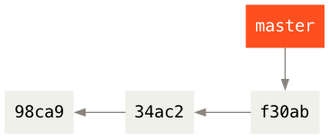

图中 =98ca9= 是第一次提交， =34ac2= 是第二次提交， =f30ab= 是最新提交。

** 创建分支

执行 =git branch= 创建分支 =testing= ，这会在当前所在的提交对象上创建一个指针。

#+begin_example
$ git branch testing
#+end_example

#+begin_src dot :file ./images/git-branch-2.png :results file
    digraph G {
        rankdir=RL;          
        bgcolor="transparent";
        nodesep=0.5; // 控制节点之间的垂直间距
        ranksep=0.6; // 控制列之间的水平间距
      
        
        node [fontname="Courier,Monospace", fontsize=14, shape=box, style=filled, penwidth=0];
        edge [color="#8a847e", arrowhead=normal, arrowsize=0.8];

        // 提交节点
        node [fillcolor="#f0f0eb", fontcolor="#000000"];
        c1 [label="98ca9"];
        c2 [label="34ac2"];
        c3 [label="f30ab"];

        // 分支节点
        node [fillcolor="#ff4f1e", fontcolor="#ffffff"];
        master [label="master"];
        testing [label="testing"];

        // 1. 提交历史水平连接
        c3 -> c2 -> c1;

        // 2. 强力约束垂直顺序：master -> c3 -> testing
        {
            rank=same; 
            master; c3; testing;
            // 增加一条隐形的边 (invis)，强制在这一列中，c3 在 testing 和 master 之间
            master -> c3 -> testing [style=invis];
        }

        // 3. 实际的连线（因为 testing 在下方，箭头向上指，我们可以显式用 dir=back 或调整连接方向）
        master -> c3;
        testing -> c3;
        {testing master} -> c3 [style=invis];
        }
#+end_src

#+RESULTS[4d800ebf449bac005f052eb61badf3a62b939ada]:
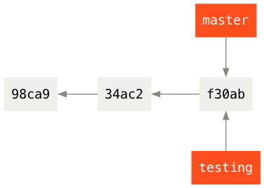

** HEAD 指针

那么，Git 又是怎么知道当前在哪一个分支上呢？
也很简单，Git 有一个名为 =HEAD= 的特殊指针，指向当前所在的本地分支（也可以将 =HEAD= 想象为当前分支的别名）。
在本例中， =HEAD= 仍然在 =master= 分支上。
因为 =git branch= 命令仅仅创建一个新分支，并不会自动切换到新分支中去。

#+begin_src dot :file ./images/git-branch-3.png :results file
  digraph G {
      rankdir=RL;          
      bgcolor="transparent";
      nodesep=0.5; // 控制节点之间的垂直间距
      ranksep=0.6; // 控制列之间的水平间距
    
      
      node [fontname="Courier,Monospace", fontsize=14, shape=box, style=filled, penwidth=0];
      edge [color="#8a847e", arrowhead=normal, arrowsize=0.8];

      // 提交节点
      node [fillcolor="#f0f0eb", fontcolor="#000000"];
      c1 [label="98ca9"];
      c2 [label="34ac2"];
      c3 [label="f30ab"];

      // 分支节点
      node [fillcolor="#ff4f1e", fontcolor="#ffffff"];
      master [label="master"];
      testing [label="testing"];

      // HEAD 指针（金色/黄色背景）
      node [fillcolor="#d49b00", fontcolor="#ffffff"];
      head [label="HEAD"];

      // 1. 提交历史水平连接
      c3 -> c2 -> c1;

      // 2. 强力约束垂直顺序：head -> master -> c3 -> testing
      {
          rank=same; 
          head; master; c3; testing;
          // 增加一条隐形的边 (invis)，强制在这一列中，c3 在 testing 和 master 之间
          head -> master -> c3 -> testing [style=invis];
      }

      // 3. 实际的连线（因为 testing 在下方，箭头向上指，我们可以显式用 dir=back 或调整连接方向）
      head -> master;
      head -> master[style=invis];
      master -> c3;
      testing -> c3;
      {testing master} -> c3 [style=invis];
      }
#+end_src

#+RESULTS[c8b97a10170a3c5709e6ca2bbe7c0d026f9f3c5d]:
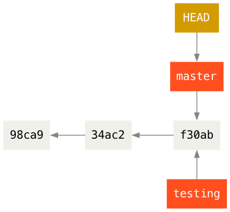

可以使用 =git log  --decorate= 命令查看各个分支当前所指的对象。

#+begin_example
$ git log --oneline --decorate
f30ab (HEAD -> master, testing) add feature #32 - ability to add new formats to the central interface
34ac2 Fixed bug #1328 - stack overflow under certain conditions
98ca9 The initial commit of my project
#+end_example

可以看到当前 =master= 和 =testing= 分支均指向校验和以 =f30ab= 开头的提交对象，并且 =HEAD= 指针在 =master= 分支上。

** 切换分支

使用 =git checkout= 命令，切换到新创建的 =testing= 分支去：

#+begin_example
$ git checkout testing
#+end_example

这样 =HEAD= 就指向 =testing= 分支了。

#+begin_src dot :file ./images/git-branch-4.png :results file
  digraph G {
      rankdir=RL;          
      bgcolor="transparent";
      nodesep=0.5; // 控制节点之间的垂直间距
      ranksep=0.6; // 控制列之间的水平间距
    
      
      node [fontname="Courier,Monospace", fontsize=14, shape=box, style=filled, penwidth=0];
      edge [color="#8a847e", arrowhead=normal, arrowsize=0.8];

      // 提交节点
      node [fillcolor="#f0f0eb", fontcolor="#000000"];
      c1 [label="98ca9"];
      c2 [label="34ac2"];
      c3 [label="f30ab"];

      // 分支节点
      node [fillcolor="#ff4f1e", fontcolor="#ffffff"];
      master [label="master"];
      testing [label="testing"];

      // HEAD 指针（金色/黄色背景）
      node [fillcolor="#d49b00", fontcolor="#ffffff"];
      head [label="HEAD"];

      // 1. 提交历史水平连接
      c3 -> c2 -> c1;

      // 2. 强力约束垂直顺序：master -> c3 -> testing -> head
      {
          rank=same; 
          head; master; c3; testing;
          // 增加一条隐形的边 (invis)，强制在这一列中，c3 在 testing 和 master 之间
          master -> c3 -> testing -> head  [style=invis];
      }

      // 3. 实际的连线（因为 testing 在下方，箭头向上指，我们可以显式用 dir=back 或调整连接方向）
      head -> testing;
      head -> testing[style=invis];
      master -> c3;
      testing -> c3;
      {testing master} -> c3 [style=invis];
      }
#+end_src

#+RESULTS[169c2fdca8f0f85d73366f3ac7968fe527b67f57]:
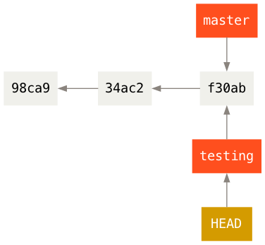

在分支 =testing= 上进行代码修改，并提交。

#+begin_example
$ vim test.rb
$ git commit -a -m 'made a change'
#+end_example

#+begin_src dot :file ./images/git-branch-5.png :results file
  digraph G {
      rankdir=RL;          
      bgcolor="transparent";
      nodesep=0.5; // 控制节点之间的垂直间距
      ranksep=0.6; // 控制列之间的水平间距
    
      
      node [fontname="Courier,Monospace", fontsize=14, shape=box, style=filled, penwidth=0];
      edge [color="#8a847e", arrowhead=normal, arrowsize=0.8];

      // 提交节点
      node [fillcolor="#f0f0eb", fontcolor="#000000"];
      c1 [label="98ca9"];
      c2 [label="34ac2"];
      c3 [label="f30ab"];
      c4 [label="87ab2"];
      
      // 分支节点
      node [fillcolor="#ff4f1e", fontcolor="#ffffff"];
      master [label="master"];
      testing [label="testing"];

      // HEAD 指针（金色/黄色背景）
      node [fillcolor="#d49b00", fontcolor="#ffffff"];
      head [label="HEAD"];

      // 提交历史水平连接
      c4 -> c3 -> c2 -> c1;

      {
  	rank=same;
  	master; c3;
  	master -> c3 [style=invis];
      }

      master -> c3;
      master -> c3 [style=invis];

      {
          rank=same; 
          c4; testing; head;
          c4 -> testing -> head  [style=invis];
      }

      head -> testing;
      head -> testing [style=invis];
      testing -> c4;
      testing -> c4 [style=invis];
      }
#+end_src

#+RESULTS[e065a318cea9a3cd4ccbaf46a97b4fb7ff0b37c2]:
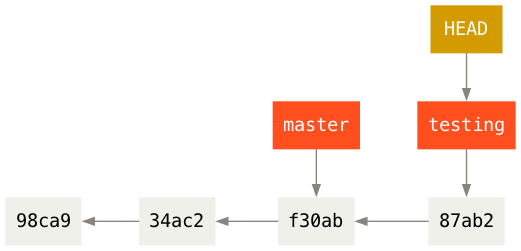

如图所示， =testing= 分支向前移动了，但是 =master= 分支却没有，它仍然指向运行 =git checkout= 时所指的对象。

现在尝试切换至 =master= 分支：

#+begin_example
$ git check out master
#+end_example

#+begin_src dot :file ./images/git-branch-6.png :results file
  digraph G {
      rankdir=RL;          
      bgcolor="transparent";
      nodesep=0.5; // 控制节点之间的垂直间距
      ranksep=0.6; // 控制列之间的水平间距
    
      
      node [fontname="Courier,Monospace", fontsize=14, shape=box, style=filled, penwidth=0];
      edge [color="#8a847e", arrowhead=normal, arrowsize=0.8];

      // 提交节点
      node [fillcolor="#f0f0eb", fontcolor="#000000"];
      c1 [label="98ca9"];
      c2 [label="34ac2"];
      c3 [label="f30ab"];
      c4 [label="87ab2"];
      
      // 分支节点
      node [fillcolor="#ff4f1e", fontcolor="#ffffff"];
      master [label="master"];
      testing [label="testing"];

      // HEAD 指针（金色/黄色背景）
      node [fillcolor="#d49b00", fontcolor="#ffffff"];
      head [label="HEAD"];

      // 提交历史水平连接
      c4 -> c3 -> c2 -> c1;

      {
  	rank=same;
  	head; master; c3;
  	head -> master -> c3 [style=invis];
      }
      head -> master;
      head -> master [style=invis];
      master -> c3;
      master -> c3 [style=invis];

      {
          rank=same; 
          c4; testing;
          c4 -> testing [style=invis];
      }

      testing -> c4;
      testing -> c4 [style=invis];
      }
#+end_src

#+RESULTS[99e5f168ac50327fb86a5c0435b6e66b60a76666]:
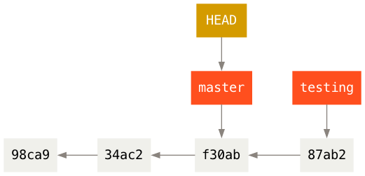

此时 =HEAD= 指回 =master= 分支，并且工作目录恢复成 =master= 分支所指向的快照内容（特别地，前面对 =test.rb= 文件的修改会不见了）。 

现在不妨再稍微做些修改并提交：

#+begin_example
$ vim test.rb
$ git commit -a -m 'made other changes'
#+end_example

现在，这个项目的提交历史已经产生了分叉。
这是因为刚才创建了新分支 =testing= ，并切换过去进行了一些工作，随后又切换回 =master= 分支进行了另外一些工作。
上述两次改动针对的是不同分支：你可以在不同分支间不断地来回切换和工作，并在时机成熟时将它们合并起来。
而所有这些工作，你需要的命令只有 =branch= 、 =checkout= 和 =commit= 。

#+begin_src dot :file ./images/git-branch-7.png :results file
    digraph G {
        rankdir=RL;          
        bgcolor="transparent";
        nodesep=0.5; // 控制节点之间的垂直间距
        ranksep=0.6; // 控制列之间的水平间距
      
        
        node [fontname="Courier,Monospace", fontsize=14, shape=box, style=filled, penwidth=0];
        edge [color="#8a847e", arrowhead=normal, arrowsize=0.8];

        // 提交节点
        node [fillcolor="#f0f0eb", fontcolor="#000000"];
        c1 [label="98ca9"];
        c2 [label="34ac2"];
        c3 [label="f30ab"];
        c4 [label="87ab2"];
        c5 [label="c2b9e"];
        
        // 分支节点
        node [fillcolor="#ff4f1e", fontcolor="#ffffff"];
        master [label="master"];
        testing [label="testing"];

        // HEAD 指针（金色/黄色背景）
        node [fillcolor="#d49b00", fontcolor="#ffffff"];
        head [label="HEAD"];

        // 提交历史水平连接
        {c5 c4} -> c3 -> c2 -> c1;

        {
    	rank=same;
    	head; master; c5;
    	c5 -> master -> head [style=invis];
        }
        master -> c5;
        master -> c5 [style=invis];
        head -> master;
        head -> master [style=invis];

        {
            rank=same; 
            c4; testing;
            c4 -> testing [style=invis];
        }

        testing -> c4;
        testing -> c4 [style=invis];
        }
#+end_src

#+RESULTS[6970a4df867e8ec519daa3e230323e2e21ebe202]:
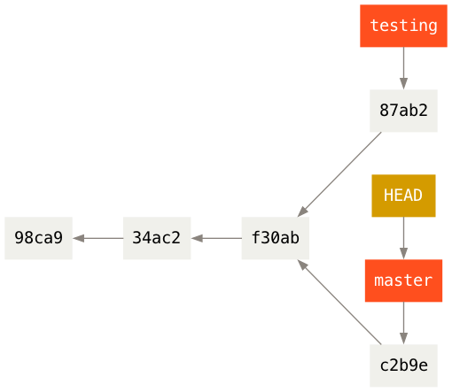

运行 =git log --oneline --decorate --graph --all= ，查看提交历史、各个分支的指向以及项目的分支分叉情况。

#+begin_example
$ git log --oneline --decorate --graph --all
,* c2b9e (HEAD, master) made other changes
| * 87ab2 (testing) made a change
|/
,* f30ab add feature #32 - ability to add new formats to the
,* 34ac2 fixed bug #1328 - stack overflow under certain conditions
,* 98ca9 initial commit of my project
#+end_example

** 合并分支

现在打算将 =testing= 分支合并入 =master= 分支。

#+begin_example
$ git checkout master
$ git merge testing
#+end_example

如果遇到冲突，需要修改冲突的文件，然后 =git add= 和 =git commit= ，完成合并。

#+begin_src dot :file ./images/git-branch-8.png :results file
  digraph G {
      rankdir=RL;          
      bgcolor="transparent";
      nodesep=0.5; // 控制节点之间的垂直间距
      ranksep=0.6; // 控制列之间的水平间距
    
      
      node [fontname="Courier,Monospace", fontsize=14, shape=box, style=filled, penwidth=0];
      edge [color="#8a847e", arrowhead=normal, arrowsize=0.8];

      // 提交节点
      node [fillcolor="#f0f0eb", fontcolor="#000000"];
      c1 [label="98ca9"];
      c2 [label="34ac2"];
      c3 [label="f30ab"];
      c4 [label="87ab2"];
      c5 [label="c2b9e"];
      c6 [label="ad82d"];
      
      // 分支节点
      node [fillcolor="#ff4f1e", fontcolor="#ffffff"];
      master [label="master"];
      testing [label="testing"];

      // HEAD 指针（金色/黄色背景）
      node [fillcolor="#d49b00", fontcolor="#ffffff"];
      head [label="HEAD"];

      // 提交历史水平连接
     c6 ->  {c5 c4} -> c3 -> c2 -> c1;

      {
  	rank=same;
  	head; master; c6;
  	c6 -> master -> head [style=invis];
      }
      master -> c6;
      master -> c6 [style=invis];
      head -> master;
      head -> master [style=invis];

      {
          rank=same; 
          c4; testing;
          c4 -> testing [style=invis];
      }

      testing -> c4;
      testing -> c4 [style=invis];
      }
#+end_src

#+RESULTS[06278bb1362a824b50efe06d16fce2ab5f718e4d]:
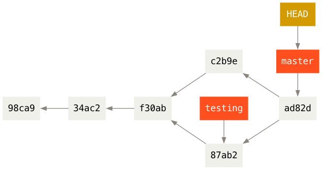

如图，现在 =master= 和 =HEAD= 都是指到 =ad82d= ，这是合并 =c2b9e= 和 =87ab2= 的结果。

** 删除分支

现在修改已经合并进来了，就不再需要 =testing= 分支了，所以可以删除这个分支。
删除分支的命令是 =git branch -d= 。

#+begin_example
$ git branch -d testing
#+end_example

#+begin_src dot :file ./images/git-branch-9.png :results file
  digraph G {
      rankdir=RL;          
      bgcolor="transparent";
      nodesep=0.5; // 控制节点之间的垂直间距
      ranksep=0.6; // 控制列之间的水平间距
    
      
      node [fontname="Courier,Monospace", fontsize=14, shape=box, style=filled, penwidth=0];
      edge [color="#8a847e", arrowhead=normal, arrowsize=0.8];

      // 提交节点
      node [fillcolor="#f0f0eb", fontcolor="#000000"];
      c1 [label="98ca9"];
      c2 [label="34ac2"];
      c3 [label="f30ab"];
      c4 [label="87ab2"];
      c5 [label="c2b9e"];
      c6 [label="ad82d"];
      
      // 分支节点
      node [fillcolor="#ff4f1e", fontcolor="#ffffff"];
      master [label="master"];
      
      // HEAD 指针（金色/黄色背景）
      node [fillcolor="#d49b00", fontcolor="#ffffff"];
      head [label="HEAD"];

      // 提交历史水平连接
      c6 ->  {c5 c4} -> c3 -> c2 -> c1;

      {
  	rank=same;
  	head; master; c6;
  	c6 -> master -> head [style=invis];
      }
      master -> c6;
      master -> c6 [style=invis];
      head -> master;
      head -> master [style=invis];
      }
#+end_src

#+RESULTS[fe20b90e63ecd30855b436af821b119cc6fc8408]:
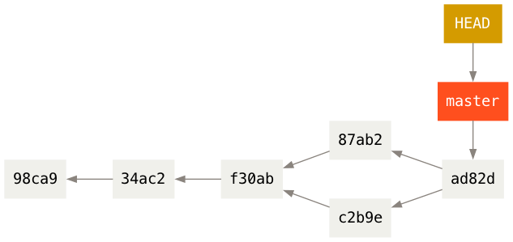

要注意的是， 因为要删除的分支包含了还未合并的工作，那么尝试使用 =git branch -d= 命令删除它时会失败。
如果真的想要删除分支并丢掉那些工作，如同帮助信息里所指出的，可以使用 =-D= 选项强制删除它。

** 查看分支

不加任何参数运行 =git branch= ，会得到当前所有分支的一个列表。

#+begin_example
$ git branch
  iss53
,* master
  testing
#+end_example

注意 =master= 分支前的 =*= 字符：它表示当前 =HEAD= 指针所指向 =master= 分支。
如果现在进行提交， =master= 分支将会随着新的工作向前移动。

如果需要查看每一个分支的最后一次提交，可以运行 =git branch -v= 命令：

#+begin_example
$ git branch -v
  iss53   93b412c fix javascript issue
,* master  7a98805 Merge branch 'iss53'
  testing 782fd34 add scott to the author list in the readmes
#+end_example

如果要查看哪些分支已经合并到当前分支，可以运行 =git branch --merged= ：

#+begin_example
$ git branch --merged
  iss53
,* master
#+end_example

这说明 =iss53= 分支已经合并到 =master= 中。
于是可以用 =git branch -d iss53= 删除 =iss53= 分支。

如果在其他分支（非 =master= 分支）的情况下，要查看有哪些分支已经合并到 =master= 分支，那么可以用 =git branch --merged master= 。

如果要查看哪些分支没有合并到当前分支，可以运行 =git branch --no-merged= 。
如果在其他分支（非 =master= 分支）的情况下，要查看有哪些分支还没有合并到 =master= 分支，那么可以用 =git branch --no-merged master= 。
例如

#+begin_example
$ git checkout testing
$ git branch --no-merged master
  topicA
  featureB
#+end_example

** 分支开发工作流

许多使用 Git 的开发者都喜欢使用这种方式来工作，比如只在 =master= 分支上保留完全稳定的代码——有可能仅仅是已经发布或即将发布的代码。
他们还有一些名为 =develop= 或者 =next= 的平行分支，被用来做后续开发或者测试稳定性。
后者这些分支不必保持绝对稳定，但是一旦达到稳定状态，它们就可以被合并入 =master= 分支了。
这样，在确保这些已完成的主题分支（短期分支，比如之前的 =testing= 分支）能够通过所有测试，并且不会引入更多 bug 之后，就可以合并入主干分支中，等待下一次的发布。

* 远程仓库的使用

** =git clone= 克隆远程仓库

假设执行 =git clone= 克隆一个位于名为 =git.ourcompany.com= 的 Git 服务器中的仓库。

#+begin_example
git clone janedoe@git.ourcompany.com:project.git
#+end_example

在不加参数下，Git 的 =clone= 命令会自动将服务器的仓库命名为 =origin= ，拉取它的所有数据到本地，创建一个指向它的 =master= 分支的指针，并且在本地将其命名为 =origin/master= 。
Git 也会给你一个与 =origin/master= 分支在指向同一个地方的本地 =master= 分支。

#+ATTR_HTML: :style width:80%; height:auto;
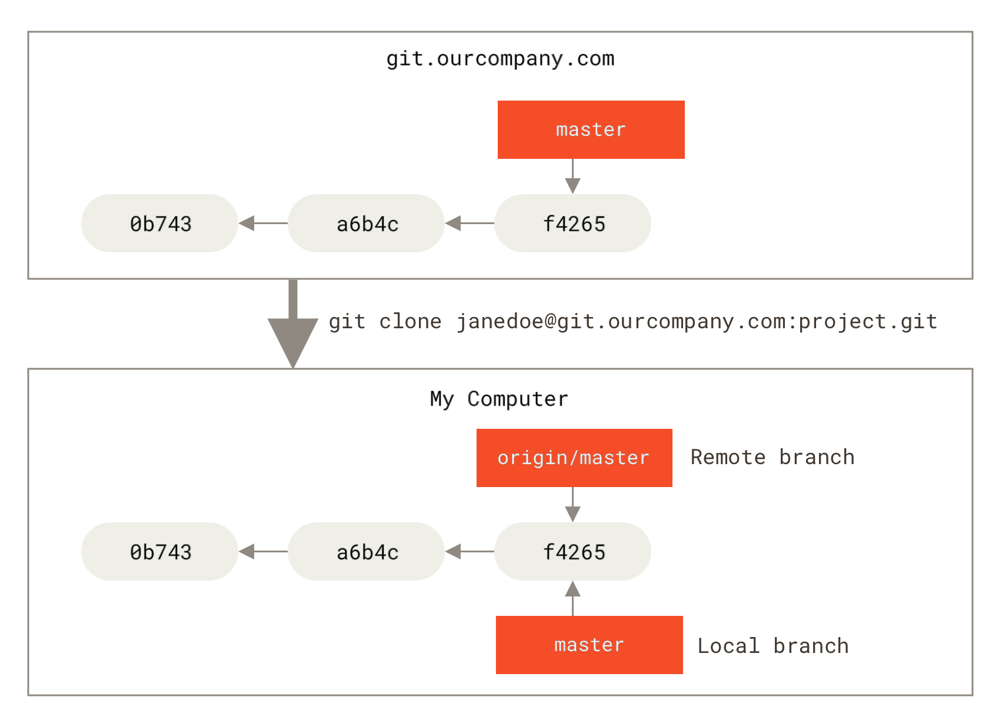

注意：远程仓库名字 =origin= 与分支名字 =master= 一样，在 Git 中并没有任何特别的含义。
=master= 是当你运行 =git init= 时默认的起始分支名字，原因仅仅是它的广泛使用。
=origin= 是当你运行 =git clone= 时默认的远程仓库名字。
如果你运行 =git clone -o booyah= ，那么你默认的远程分支名字将会是 =booyah/master= 。

如果你在本地的 =master= 分支做了一些工作，在同一段时间内有其他人推送提交到 =git.ourcompany.com= 并且更新了它的 =master= 分支，这就是说你们的提交历史已走向不同的方向。
即便这样，只要你保持不与 =origin= 服务器连接（并拉取数据），你的 =origin/master= 指针就不会移动。

#+ATTR_HTML: :style width:80%; height:auto;
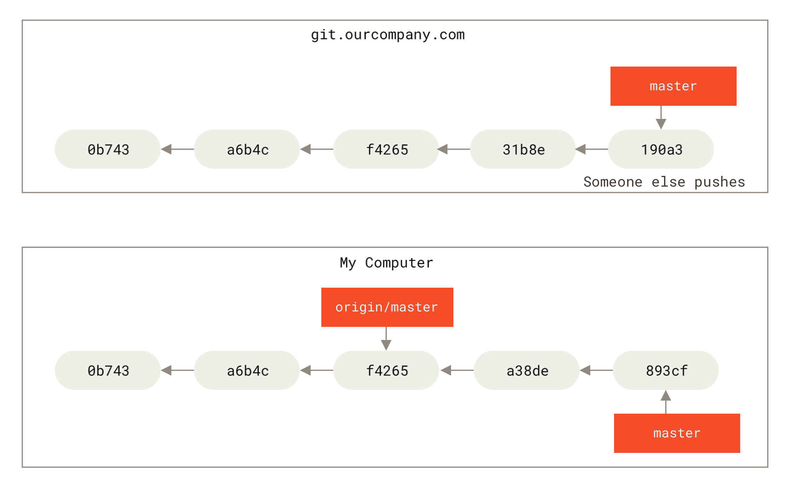

** =git fecth= 抓取远程仓库

如果要与远程仓库同步数据，运行 =git fetch <remote>= 命令（在本例中为 =git fetch origin= ， =orgin= 是远程仓库的名字）。
这个命令查找 “origin” 是哪一个服务器（在本例中，它是 =git.ourcompany.com= ），从中抓取本地没有的数据，并且更新本地数据库，移动 =origin/master= 指针到更新之后的位置。

#+ATTR_HTML: :style width:80%; height:auto;
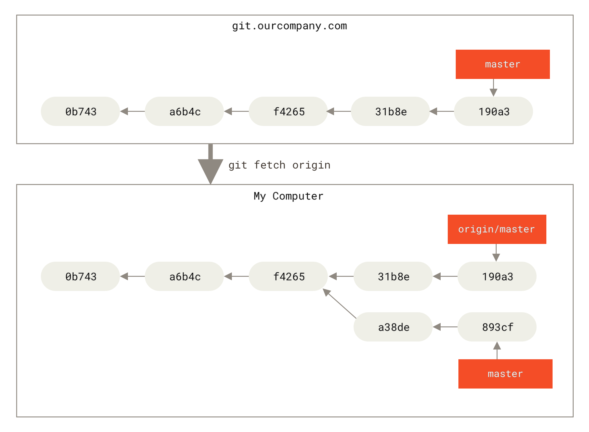

** =git remote add= 添加远程仓库

假设有另一个服务器位于 =git.team1.ourcompany.com= 。
可以运行 =git remote add= 命令将该服务器中的仓库添加到当前的项目。
将这个远程仓库命名为 =teamone= ，将其作为完整 URL 的缩写。

#+begin_example
$ git remote add teamone git://git.team1.ourcompany.com
#+end_example

运行 =git fetch teamone= 来抓取远程仓库 =teamone= 有而本地没有的数据。
现在假设那台服务器上现有的数据是 =origin= 服务器上的一个子集，所以 Git 并不会抓取数据而是会设置远程跟踪分支 =teamone/master= 指向 =teamone= 的 =master= 分支。

#+begin_example
$ git fetch teamone
#+end_example

#+ATTR_HTML: :style width:80%; height:auto;
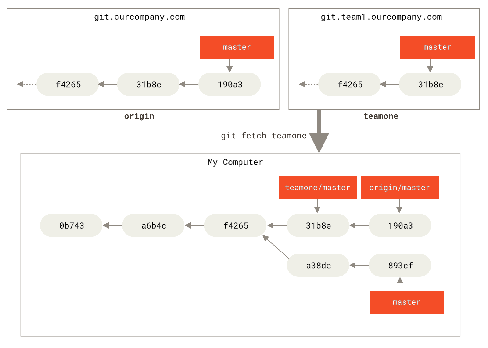

** 查看远程仓库

如果想查看你已经配置的远程仓库服务器，可以运行 =git remote= 命令。
它会列出你指定的每一个远程服务器的简写。
如果你已经克隆了仓库，那么至少应该能看到 =origin= - 这是 Git 给你克隆的仓库服务器的默认名字：

#+begin_example
$ git clone https://github.com/schacon/ticgit
Cloning into 'ticgit'...
remote: Reusing existing pack: 1857, done.
remote: Total 1857 (delta 0), reused 0 (delta 0)
Receiving objects: 100% (1857/1857), 374.35 KiB | 268.00 KiB/s, done.
Resolving deltas: 100% (772/772), done.
Checking connectivity... done.
$ cd ticgit
$ git remote
origin
#+end_example

你也可以指定选项 =-v= ，会显示需要读写远程仓库使用的 Git 保存的简写与其对应的 URL。

#+begin_example
$ git remote -v
origin	https://github.com/schacon/ticgit (fetch)
origin	https://github.com/schacon/ticgit (push)
#+end_example

如果你的远程仓库不止一个，该命令会将它们全部列出。
例如，与几个协作者合作的，拥有多个远程仓库的仓库看起来像下面这样：

#+begin_example
$ cd grit
$ git remote -v
bakkdoor  https://github.com/bakkdoor/grit (fetch)
bakkdoor  https://github.com/bakkdoor/grit (push)
cho45     https://github.com/cho45/grit (fetch)
cho45     https://github.com/cho45/grit (push)
defunkt   https://github.com/defunkt/grit (fetch)
defunkt   https://github.com/defunkt/grit (push)
koke      git://github.com/koke/grit.git (fetch)
koke      git://github.com/koke/grit.git (push)
origin    git@github.com:mojombo/grit.git (fetch)
origin    git@github.com:mojombo/grit.git (push)
#+end_example

** =git push= 推送

将本地分支推送远程分支的命令是 =git push [remote-name] [branch-name]= 。
当你想要将 =master= 分支推送到 =origin= 服务器时（再次说明，克隆时通常会自动帮你设置好那两个名字），那么运行这个命令就可以将你所做的备份到服务器：

#+begin_example
$ git push origin master
#+end_example

只有当你有所克隆服务器的写入权限，并且之前没有人推送过时，这条命令才能生效。
当你和其他人在同一时间克隆，他们先推送到上游然后你再推送到上游，你的推送就会被拒绝。
你必须先将他们的工作抓取下来并将其合并进你的工作后才能推送。

当你想要公开分享一个分支（不一定是本地的 =master= 分支）时，需要将其推送到有写入权限的远程仓库上。
本地的分支并不会自动与远程仓库同步——你必须显式地推送想要分享的分支。
这样，你可以把不愿意分享的内容放到私人分支上，而将需要和别人协作的内容推送到公开分支。

再看一个例子。
假设现在和别人一起在名为 =serverfix= 的分支上工作，你可以像推送第一个分支那样推送它。
运行 =git push <remote> <branch>= ：

#+begin_example
$ git push origin serverfix
Counting objects: 24, done.
Delta compression using up to 8 threads.
Compressing objects: 100% (15/15), done.
Writing objects: 100% (24/24), 1.91 KiB | 0 bytes/s, done.
Total 24 (delta 2), reused 0 (delta 0)
To https://github.com/schacon/simplegit
 * [new branch]      serverfix -> serverfix
#+end_example

也可以运行 =git push origin serverfix:serverfix= ，它会做同样的事，也就是「推送本地的 =serverfix= 分支，将其作为远程仓库的 =serverfix= 分支」。
如果并不想让远程仓库上的分支叫做 =serverfix= ，可以运行 =git push origin serverfix:awesomebranch= 来将本地的 =serverfix= 分支推送到远程仓库上的 =awesomebranch= 分支。

下一次其他协作者从服务器上抓取（ =git fetch= ）数据时，Git 会在他们的本地生成一个远程分支 =origin/serverfix= ，指向服务器的 =serverfix= 分支的引用：

#+begin_example
$ git fetch origin
remote: Counting objects: 7, done.
remote: Compressing objects: 100% (2/2), done.
remote: Total 3 (delta 0), reused 3 (delta 0)
Unpacking objects: 100% (3/3), done.
From https://github.com/schacon/simplegit
 * [new branch]      serverfix    -> origin/serverfix
#+end_example

** 建立跟踪分支

刚才讲到其他协作者执行 =git fetch origin= ，在本地生成了远程分支 =orgin/serverfix= ，指向服务器的 =serverfix= 分支的引用。
但协作者的本地不会自动生成一份该分支的可编辑副本（拷贝），而是只有一个不可以修改的 =origin/serverfix= 指针。
这时协作者可以有两种做法：

+ 可以运行 =git merge origin/serverfix= 将这些工作合并到当前本地所在的分支。
+ 在本地建立跟踪 =orgin/serverfix= 的分支。

第二种做法，具体来说是执行命令 =运行 git checkout -b <branch> <remote>/<branch>= ：

#+begin_example
$ git checkout -b serverfix origin/serverfix
Branch serverfix set up to track remote branch serverfix from origin.
Switched to a new branch 'serverfix'
#+end_example

这会给你一个用于工作的本地分支 =serverfix= ，并且起点位于 =origin/serverfix= 。
这个本地分支会跟踪服务器的 =serverfix= 分支：以后在跟踪分支上输入 =git pull= ，Git 能自动地识别去哪个服务器上抓取、合并到哪个分支。

前面 =git clone= 克隆一个仓库时，它通常会自动地创建一个跟踪 =origin/master= 的 =master= 分支。

如果想要将本地分支与远程分支设置为不同的名字，可以执行

#+begin_example
$ git checkout -b sf origin/serverfix
Branch sf set up to track remote branch serverfix from origin.
Switched to a new branch 'sf'
#+end_example

现在，本地分支 =sf= 的起点位于 =orgin/serverfix= ，并且跟踪服务器上的 =serverfix= 分支。

如果要设置已有的本地分支跟踪刚刚拉取下来的远程分支 =origin/serverfix= ，可以进入该本地分支，然后执行

#+begin_example
$ git branch -u origin/serverfix
Branch serverfix set up to track remote branch serverfix from origin.
#+end_example

** 查看跟踪分支

如果想要查看设置的所有跟踪分支，可以使用 =git branch= 的 =-vv= 选项。
这会将所有的本地分支列出来并且包含更多的信息，如每一个分支正在跟踪哪个远程分支与本地分支是否是领先、落后或是都有。

#+begin_example
$ git branch -vv
iss53     7e424c3 [origin/iss53: ahead 2] forgot the brackets
master    1ae2a45 [origin/master] deploying index fix
,* serverfix f8674d9 [teamone/server-fix-good: ahead 3, behind 1] this should do it
testing   5ea463a trying something new
#+end_example

这里可以看到 =iss53= 分支正在跟踪 =origin/iss53= 并且 “ahead” 是 2，意味着本地有两个提交还没有推送到服务器上。
也能看到 =master= 分支正在跟踪 =origin/master= 分支并且是最新的。
接下来可以看到 =serverfix= 分支正在跟踪 =teamone= 服务器上的 =server-fix-good= 分支并且领先 3 落后 1，意味着服务器上有一次提交还没有合并入同时本地有三次提交还没有推送。
最后看到 =testing= 分支并没有跟踪任何远程分支。

需要重点注意的一点是这些数字的值来自于你从每个服务器上最后一次抓取的数据。
这个命令并没有连接服务器，它只会告诉你关于本地缓存的服务器数据。
如果想要统计最新的领先与落后数字，需要在运行此命令前抓取所有的远程仓库：

#+begin_example
$ git fetch --all; git branch -vv
#+end_example

** =git pull= 拉取远程仓库

前面讲到 =git fetch= 命令从服务器上抓取本地没有的数据时，它并不会修改工作目录中的内容。
它只会获取数据然后让你自己合并。
然而，有一个命令叫作 =git pull= ，在大多数情况下它的含义是一个 =git fetch= 紧接着一个 =git merge= 命令。

如果有设置好的跟踪分支，不管它是显式地设置还是通过 =clone= 或 =checkout= 命令为你创建的， =git pull= 都会查找当前分支所跟踪的服务器与分支，从服务器上抓取数据然后尝试合并入那个远程分支。

由于 =git pull= 的魔法经常令人困惑所以通常单独显式地使用 =fetch= 与 =merge= 命令会更好一些。

** 删除远程分支

假设你已经通过远程分支做完所有的工作了——比如说，你和你的协作者已经完成了一个特性，并且将其合并到了远程仓库的 =master= 分支（或任何其他稳定代码分支）。
此时可以运行带有 =--delete= 选项的 =git push= 命令来删除一个远程分支。
比如，如果想要从服务器上删除 =serverfix= 分支，运行下面的命令：

#+begin_example
$ git push origin --delete serverfix
To https://github.com/schacon/simplegit
 - [deleted]         serverfix
#+end_example

基本上这个命令做的只是从服务器上移除这个指针。
Git 服务器通常会保留数据一段时间直到垃圾回收运行，所以如果不小心删除掉了，通常是很容易恢复的。

* 变基

** 变基 =git rebase= 的基本操作

变基 =rebase= 和合并 =merge= 都是中整合的不同分支的方法。
两种最终结果所指向的快照始终是一样的，只不过提交历史不同罢了。

假设现在有两个不同的分支，如图：

#+begin_src dot :file ./images/git-rebase-1.png :results file
    digraph G {
        rankdir=RL;          
        bgcolor="transparent";
        nodesep=0.5; // 控制节点之间的垂直间距
        ranksep=0.6; // 控制列之间的水平间距
        
        node [fontname="Courier,Monospace", fontsize=14, shape=box, style=filled, penwidth=0];
        edge [color="#8a847e", arrowhead=normal, arrowsize=0.8];

        // 提交节点
        node [fillcolor="#f0f0eb", fontcolor="#000000"];
        C0;
        C1;
        C2;
        C3;
        C4;
        
        node [fillcolor="#ff4f1e", fontcolor="#ffffff"];
        experiment [label="experiment"];
        master [label="master"];

        // 提交历史水平连接
        {C3 C4} -> C2 -> C1 -> C0;

        {
    	rank=same;
    	master; C3;
    	master -> C3 [style=invis];
        }
        master -> C3;
        master -> C3 [style=invis];

        {
            rank=same; 
            C4; experiment;
            C4 -> experiment [style=invis];
        }

        experiment -> C4;
        experiment -> C4 [style=invis];
        }
#+end_src

#+RESULTS[6d68e1ab08bd7303b98dfee044716ad2a3b37932]:
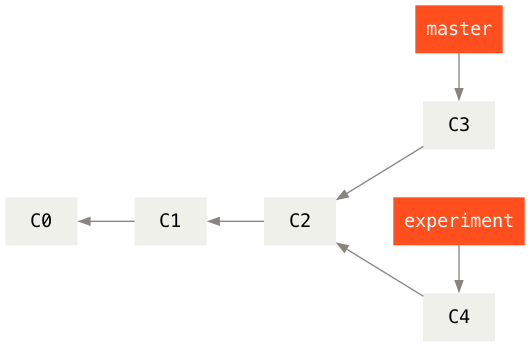

之前介绍过，整合分支最容易的方法是 =merge= 命令。
它把两个分支的最新快照 =C3= 和 =C4= 以及二者最近的共同祖先 =C2= 进行三方合并，合并的结果是生成一个新的快照 =C5= （并提交）。

#+begin_src dot :file ./images/git-rebase-2.png :results file
  digraph G {
      rankdir=RL;          
      bgcolor="transparent";
      nodesep=0.5; // 控制节点之间的垂直间距
      ranksep=0.6; // 控制列之间的水平间距
      
      node [fontname="Courier,Monospace", fontsize=14, shape=box, style=filled, penwidth=0];
      edge [color="#8a847e", arrowhead=normal, arrowsize=0.8];

      // 提交节点
      node [fillcolor="#f0f0eb", fontcolor="#000000"];
      C0;
      C1;
      C2;
      C3;
      C4;
      C5;
      
      node [fillcolor="#ff4f1e", fontcolor="#ffffff"];
      experiment [label="experiment"];
      master [label="master"];

      // 提交历史水平连接
      C5 -> {C3 C4} -> C2 -> C1 -> C0;

      {
  	rank=same;
  	master; C5;
  	master -> C5 [style=invis];
      }
      master -> C5;
      master -> C5 [style=invis];

      {
          rank=same; 
          C4; experiment;
          C4 -> experiment [style=invis];
      }

      experiment -> C4;
      experiment -> C4 [style=invis];
      }
#+end_src

#+RESULTS[1b9a55e859e44bcbd5ebb86bd5fab4fabbb53877]:
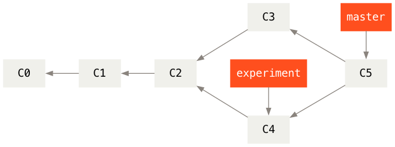

而使用 =git rebase= 的方法是先进入 =experiment= 分支，然后将它变基到 =master= 分支上：

#+begin_example
$ git checkout experiment
$ git rebase master
First, rewinding head to replay your work on top of it...
Applying: added staged command
#+end_example

它的原理是首先找到这两个分支（即当前分支 =experiment= 、变基操作的目标基底分支 =master= ）的最近共同祖先 =C2= ，然后对比当前分支相对于该祖先的历次提交，提取相应的修改并存为临时文件，然后将当前分支指向目标基底 =C3= , 最后以此将之前另存为临时文件的修改依序应用。

#+begin_src dot :file ./images/git-rebase-3.png :results file
  digraph G {
      rankdir=RL;          
      bgcolor="transparent";
      nodesep=0.5; // 控制节点之间的垂直间距
      ranksep=0.6; // 控制列之间的水平间距
      
      node [fontname="Courier,Monospace", fontsize=14, shape=box, style=filled, penwidth=0];
      edge [color="#8a847e", arrowhead=normal, arrowsize=0.8];

      // 提交节点
      node [fillcolor="#f0f0eb", fontcolor="#000000"];
      C0;
      C1;
      C2;
      C3;
      C4 [fillcolor="#f0f0eb80",fontcolor="#00000080"];
      C5 [label="C4'"];
      
      node [fillcolor="#ff4f1e", fontcolor="#ffffff"];
      experiment [label="experiment"];
      master [label="master"];

      // 提交历史水平连接
      {C3 C4} -> C2 -> C1 -> C0;
      C5 -> C3;

      {
  	rank=same;
  	master; C3;
  	master -> C3 [style=invis];
      }
      master -> C3;
      master -> C3 [style=invis];

      {
          rank=same; 
          C5; experiment;
          C5 -> experiment [style=invis];
      }

      experiment -> C5;
      experiment -> C5 [style=invis];
      }
#+end_src

#+RESULTS[b22da9e78e2f28a07344cb94f040c2afb249f768]:
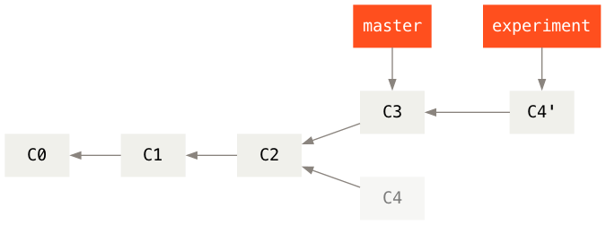

现在回到 =master= 分支，进行一次快进合并。

#+begin_example
$ git checkout master
$ git merge experiment
#+end_example

#+begin_src dot :file ./images/git-rebase-4.png :results file
  digraph G {
      rankdir=RL;          
      bgcolor="transparent";
      nodesep=0.5; // 控制节点之间的垂直间距
      ranksep=0.6; // 控制列之间的水平间距
      
      node [fontname="Courier,Monospace", fontsize=14, shape=box, style=filled, penwidth=0];
      edge [color="#8a847e", arrowhead=normal, arrowsize=0.8];

      // 提交节点
      node [fillcolor="#f0f0eb", fontcolor="#000000"];
      C0;
      C1;
      C2;
      C3;
      C5 [label="C4'"];
      
      node [fillcolor="#ff4f1e", fontcolor="#ffffff"];
      experiment [label="experiment"];
      master [label="master"];

      // 提交历史水平连接
      C5 -> C3 -> C2 -> C1 -> C0;

      {
  	rank=same;
  	master; C5; experiment;
  	master -> C5 -> experiment [style=invis];
      }
      master -> C5;
      master -> C5 [style=invis];
      experiment -> C5;
      experiment -> C5 [style=invis];
      }
#+end_src

#+RESULTS[8b1d57a6ef32708bf0a823d49741895a88b762d5]:
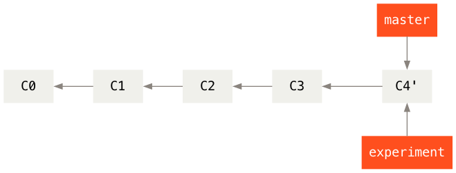

此时， =C4'= 指向的快照就和 =git merge= 方法中 =C5= 指向的快照一模一样了。
这两种整合方法的最终结果没有任何区别，但是变基使得提交历史更加整洁。
你在查看一个经过变基的分支的历史记录时会发现，尽管实际的开发工作是并行的，但它们看上去就像是串行的一样，提交历史是一条直线没有分叉。

一般我们这样做的目的是为了确保在向远程分支推送时能保持提交历史的整洁——例如向某个其他人维护的项目贡献代码时。
在这种情况下，你首先在自己的分支里进行开发，当开发完成时你需要先将你的代码变基到 =origin/master= 上，然后再向主项目提交修改。
这样的话，该项目的维护者就不再需要进行整合工作，只需要快进合并便可。

请注意，无论是通过变基，还是通过三方合并，整合的最终结果所指向的快照始终是一样的，只不过提交历史不同罢了。
变基是将一系列提交按照原有次序依次应用到另一分支上，而合并是把最终结果合在一起。

** 变基的风险

变基也并非完美无缺，要用它得遵守一条准则：

*如果提交存在于你的仓库之外，而别人可能基于这些提交进行开发，那么不要执行变基。*

如果你遵循这条金科玉律，就不会出差错。
否则，人民群众会仇恨你，你的朋友和家人也会嘲笑你，唾弃你。

让我们来看一个在公开的仓库上执行变基操作所带来的问题。
假设你从一个中央服务器克隆然后在它的基础上进行了一些开发。
你的提交历史如图所示：

#+ATTR_HTML: :style width:80%; height:auto;
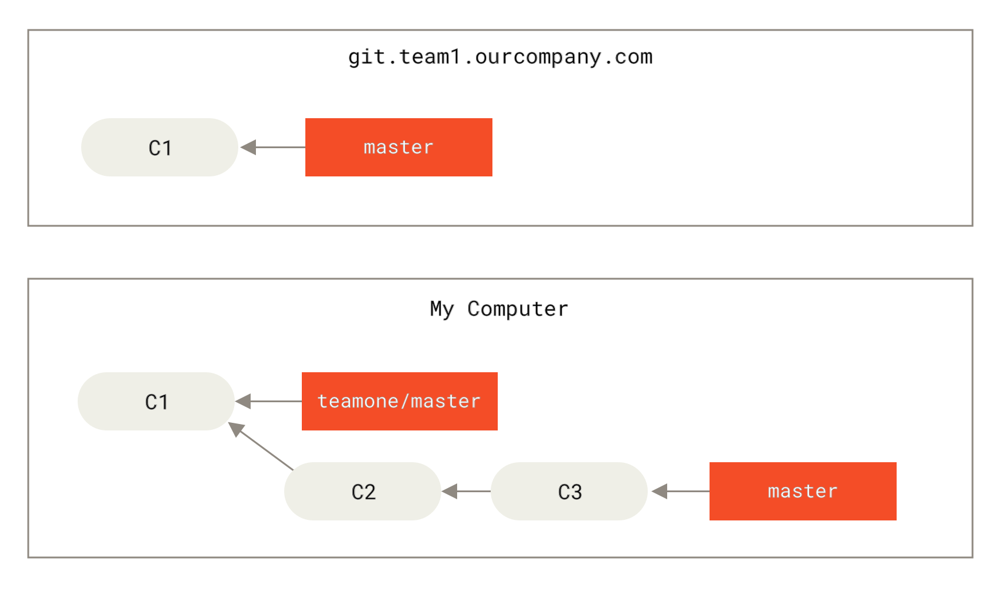

然后，某人又向中央服务器提交了一些修改，其中还包括一次合并。
你抓取了这些在远程分支上的修改，并将其合并到你本地的开发分支，然后你的提交历史就会变成这样：

#+ATTR_HTML: :style width:80%; height:auto;
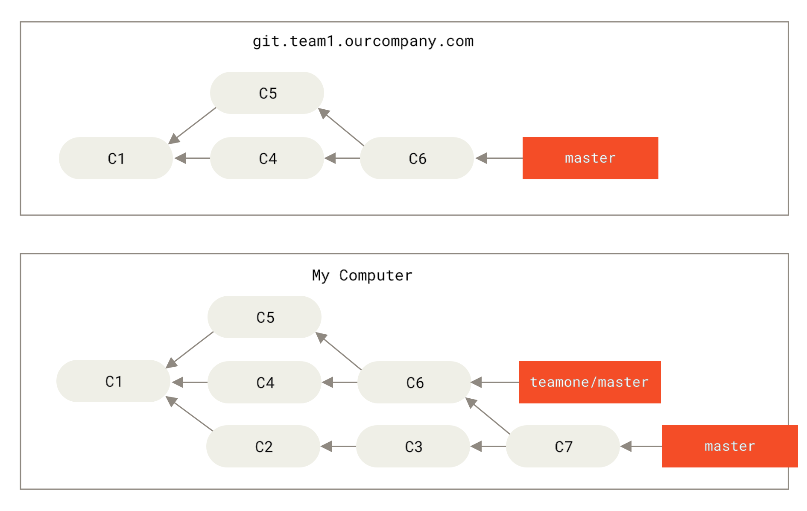

接下来，这个人又决定把合并操作回滚，改用变基；继而又用 =git push --force= 命令覆盖了服务器上的提交历史。
之后你从服务器抓取更新，会发现多出来一些新的提交。

#+ATTR_HTML: :style width:80%; height:auto;
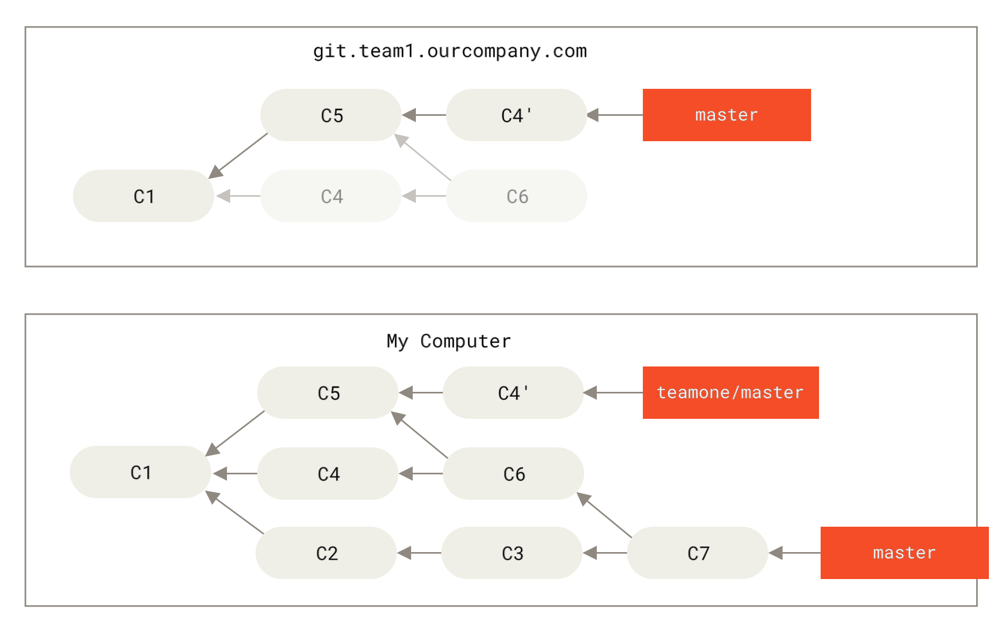

结果就是你们两人的处境都十分尴尬。
如果你执行 =git pull= 命令，你将合并来自两条提交历史的内容，生成一个新的合并提交，最终仓库会如图所示：

#+ATTR_HTML: :style width:80%; height:auto;
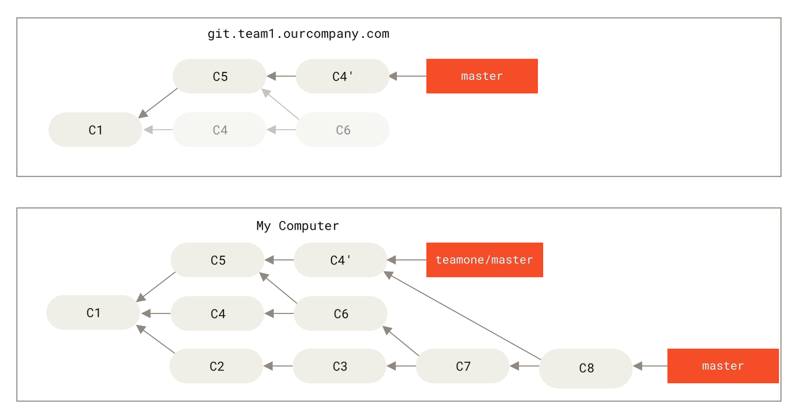

此时如果你执行 =git log= 命令，你会发现有两个提交的作者、日期、日志居然是一样的，这会令人感到混乱。
此外，如果你将这一堆又推送到服务器上，你实际上是将那些已经被变基抛弃的提交又找了回来，这会令人感到更加混乱。
很明显对方并不想在提交历史中看到 =C4= 和 =C6= ，因为之前就是他把这两个提交通过变基丢弃的。

总结，如果你只对不会离开你电脑的提交执行变基，那就不会有事。
如果你对已经推送过的提交执行变基，但别人没有基于它的提交，那么也不会有事。
如果你对已经推送至共用仓库的提交上执行变基命令，并因此丢失了一些别人的开发所基于的提交，那你就有大麻烦了，你的同事也会因此鄙视你。

如果你或你的同事在某些情形下决意要这么做，请一定要通知每个人执行 =git pull --rebase= 命令，这样尽管不能避免伤痛，但能有所缓解。

* 杂项

** =git config= 设置

#+begin_src bash
  # 查看 git 全局的用户名和电子邮件
  git config --global user.name
  git config --global user.email

  # 修改 git 全局的用户名和电子邮件
  git config --global user.name "Mona Lisa"
  git config --global user.email "Lisa@outlook.com"

  # 查看 git 在某个仓库的用户名和电子邮件
  # 首先 cd 进入该仓库
  git config user.name
  git config user.email

  # 修改 git 在某个仓库的用户名和电子邮件
  # 首先进入该仓库
  git config user.name "Mona Lisa"
  git config user.email "Lisa@outlook.com" # 修改信息会保存在 .git/config 中

  # 查看 git 的完整配置
  git config --list
#+end_src

** =.gitignore= 文件

通过 =touch .gitignore= 文件，声明不同步的文件的格式，例如

#+begin_example
  # Ignore LyX backup and autosave files
  # http://www.lyx.org/
  ,*.lyx~
  ,*.lyx#
  ,*.pdf

  # 忽略所有以 ~ 结尾的文件
  ,*~
#+end_example

再看一个 =.gitignore= 文件的例子：

#+begin_example
  # no .a files
  ,*.a

  # but do track lib.a, even though you're ignoring .a files above
  !lib.a

  # only ignore the TODO file in the current directory, not subdir/TODO
  /TODO

  # ignore all files in the build/ directory
  build/

  # ignore doc/notes.txt, but not doc/server/arch.txt
  doc/*.txt

  # ignore all .pdf files in the doc/ directory
  doc/**/*.pdf
#+end_example

** 查找 git 的使用手册

有三种方法可以找到 Git 命令的使用手册：

#+begin_example
  git help <verb>
  git <verb> --help
  man git-<verb>

  # 比如，要想获得 config 命令的手册，可以执行
  git help config
#+end_example

** 更改 git 的默认编辑器

Git 的默认编辑器是 =vi= 。
比如，执行 =git commit= 后会自动启动 =vi= 编辑器。
可以使用 =git config --global core.editor= 设定你喜欢的编辑软件，如 =Emacs= 等等。

** 设置 =git diff= 调用的软件

如果你喜欢通过图形化的方式或其它格式输出方式的话，可以使用 =git difftool= 命令来用 =Araxis= ， =emerge= 或 =vimdiff= 等软件输出 =diff= 分析结果。
使用 =git difftool --tool-help= 命令来看你的系统支持哪些 Git Diff 插件。

#+begin_example
$ git difftool --tool-help

'git difftool --tool=<tool>' may be set to one of the following:
		araxis           Use Araxis Merge (requires a graphical session)
		emerge           Use Emacs' Emerge
		gvimdiff         Use gVim (requires a graphical session)
		nvimdiff         Use Neovim
		opendiff         Use FileMerge (requires a graphical session)
		vimdiff          Use Vim

	user-defined:
		sourcetree.cmd /Applications/Sourcetree.app/Contents/Resources/opendiff-w.sh "$LOCAL" "$REMOTE" -ancestor "$BASE" -merge "$MERGED"
		sourcetree.cmd opendiff "$LOCAL" "$REMOTE"

The following tools are valid, but not currently available:
		bc               Use Beyond Compare (requires a graphical session)
		bc3              Use Beyond Compare (requires a graphical session)
		bc4              Use Beyond Compare (requires a graphical session)
		codecompare      Use Code Compare (requires a graphical session)
		deltawalker      Use DeltaWalker (requires a graphical session)
		diffmerge        Use DiffMerge (requires a graphical session)
		diffuse          Use Diffuse (requires a graphical session)
		ecmerge          Use ECMerge (requires a graphical session)
		examdiff         Use ExamDiff Pro (requires a graphical session)
		guiffy           Use Guiffy's Diff Tool (requires a graphical session)
		kdiff3           Use KDiff3 (requires a graphical session)
		kompare          Use Kompare (requires a graphical session)
		meld             Use Meld (requires a graphical session)
		p4merge          Use HelixCore P4Merge (requires a graphical session)
		smerge           Use Sublime Merge (requires a graphical session)
		tkdiff           Use TkDiff (requires a graphical session)
		winmerge         Use WinMerge (requires a graphical session)
		xxdiff           Use xxdiff (requires a graphical session)

Some of the tools listed above only work in a windowed
environment. If run in a terminal-only session, they will fail.
#+end_example

从结果看到可以使用 Emacs 的 =emerge= ，那么可以执行 =git difftool --tool=emerge= 。

* =Magit= 使用

在 =~/.emacs.d/init.el= 文件中配置
#+begin_src lisp
  ;; Magit 自动安装+绑定快捷键
  (use-package magit
    :ensure t          ;; 不存在则自动从 MELPA 安装
    :bind ("C-x g" . magit-status) ;; C-x g 打开 Git 状态面板
    :config
    ;; 可选：刷新仓库时自动拉取远程
    (setq magit-auto-revert-mode t))
#+end_src

参考资料 [[https://magit.vc/][It's Magit!]]

* 删去/待整理

=git rm= 移除文件 [[https://bingohuang.gitbooks.io/progit2/content/02-git-basics/sections/recording-changes.html]]

一个应用场景：当你忘记添加 =.gitignore= 文件，不小心把一个很大的日志文件或一堆 =.a= 这样的编译生成文件添加到暂存区时，这一做法尤其有用。

=git mv= 移动文件

#+begin_src bash
  # 初始化仓库
  git init

  # 查看仓库状态
  git status

  # 向暂存区中添加某一文件 readme.md
  git add readme.md
  # 或添加全面文件
  git add .

  # 保存仓库的历史记录
  git commit -m "balabala..."
  # 或者直接执行
  git commit

  # 查看提交日志
  git log
  # 只显示提交信息的第一行
  git log --pretty=short
  # 只显示指定目录、文件的日志
  git log readme.md
  # 显示文件的改动
  git log -p
  git log -p readme.md
  # 用图表形式输出提交日志，非常直观
  git log --graph

  # git log 命令只能查看以当前状态为终点的历史日志
  # 查看当前仓库所有执行过的操作的日志，可以执行
  git reflog

  # 查看工作树和暂存区的差别
  git diff

  # 退回到某个历史版本，比如假设该版本的哈希值是 8b3fa5934ad94d62bbe28984a6a5375f27ca43e8
  git checkout 8b3fa5934ad94d62bbe28984a6a5375f27ca43e8
  # 或者需要该哈希值的前 4 位或以上
  git checkout 8b3f

  # 返回到主干分支
  git checkout main
#+end_src

