#+title: R 笔记
#+author: zbliang
#+DATE: 2026-07-07
#+HUGO_BASE_DIR: ../
#+HUGO_SECTION: posts
#+HUGO_PAIRED_OUT_DIR: ../static
#+HUGO_TAGS: R
#+HUGO_CATEGORIES: tech
#+HUGO_DRAFT: false

#+STARTUP: show2levels
#+PROPERTY: header-args:R :eval no-export :results output :exports both :cache yes

#+BEGIN_EXPORT html

#+END_EXPORT

这是书籍

#+begin_example
Darrin Speegle, Bryan Clair. Probability, Statistics, and Data: A Fresh Approach Using R, 2022.
#+end_example

的笔记。

这本书可以在线阅读，网址是： https://probstatsdata.com/ 。

这个笔记需要加载以下的包：

#+begin_src R :session *R* :results none
  library(dplyr)
  library(ggplot2)
  # 关闭 tibble 的 ANSI 颜色输出
  options(cli.num_colors = 1)
#+end_src

* Probability

#+begin_question
Exercise 2.7.

Blood types O, A, B, and AB have the following distribution in the United States:

| Type | A    | AB       |   B |   O |
| Probability | 0.40  | 0.04      | 0.11 | 0.45 |

What is the probability that two randomly selected people have the same blood type?
#+end_question

#+begin_solution

第一个人的血型与第二个人的血型是相互独立的，所以两人血型相同的概率为
#+begin_src R
  0.40*0.40 + 0.04*0.04 + 0.11*0.11 + 0.45*0.45
#+end_src

#+RESULTS:
: 0.3762

用模拟（simulation）的办法计算概率。
通过命令 =sample(x = bloodtypes, size =  2, prob = bloodprobs, replace = T)= 生成两个人的血型，再利用 =anyDuplicated= 判断是否相同，最后通过 =replicate= 重复这个过程 100000 次。

完整的代码是：
#+begin_src R
  bloodtypes <- c("A", "AB", "B", "O")
  bloodprobs <- c(0.45, 0.40, 0.11, 0.04)
  eventA <- replicate(100000, {
    select_2_people <- sample(x = bloodtypes, size =  2, prob = bloodprobs, replace = T)
    anyDuplicated(select_2_people) > 0
  })
  mean(eventA)
#+end_src

#+RESULTS:
: 0.37642

可见概率约为 37.6% （运行时间 1.3s），与理论的结果相约。

#+end_solution

#+begin_question
Exercise 2.10.
Estimate the probability that the sum of five dice is between 15 and 20, inclusive.
#+end_question

#+begin_solution

#+begin_src R
  eventA <- replicate(1000000, {
    sumDice <- sum(sample(x = 1:6, size = 5, replace = T))
    (sumDice <= 20) & (sumDice >= 15)
  })
  mean(eventA)
#+end_src

#+RESULTS:
: 0.55703

可见概率约为 55.7%（运行时间 11.3s）。

#+end_solution

#+begin_question
Exercise 2.15.

Assuming that there are no leap-day babies and that all birthdays are equally likely, estimate the probability that at least three people have the same birthday in a group of 50 people. (Hint: try using table.)
#+end_question

#+begin_solution

使用模拟计算该概率的基本想法：
+  =sample(x = 1:365, size = 50, replace = T)= 生成一个基本事件。
  这是一个 50 维的向量 =birthday= ，每个分量代表一个人，其数值 $\in \{1,2,3,\dots, 365\}$，表示出生在第几天。
+ =table(birthday)= 罗列了向量 =birthday= 的分量出现过哪些值，并统计每个值出现的次数。
  =max(table(birthday))= 返回最常出现的值的出现次数。

完整的代码是：
#+begin_src R
  at_least_3_same_birthday <- replicate(1000000, {
    birthday <- sample(x = 1:365, size = 50, replace = T)
    max(table(birthday)) >= 3
  })
  mean(at_least_3_same_birthday)
#+end_src

#+RESULTS:
: 0.126214

运行的结果是概率约为 12.6%（运行时间 147.1s）。

#+end_solution

#+begin_question
Exercise 2.16.

If 100 balls are randomly placed into 20 urns, estimate the probability that at least one of the urns is empty.
#+end_question

#+begin_solution

*第一种解法：区分每个球，以及每个罐。*

此时总的情况数为 $100^{20}$。
利用容斥原理，符合至少一个罐是空的情况数为
$$
\sum_{k=0}^{20} (-1)^k \binom{20}{k} (20-k)^{100}
$$
因此，该概率值为
$$
1 - \sum_{k=0}^{20} (-1)^k \binom{20}{k} (1-\frac{k}{20})^{100}
$$

计算上式的 R 代码为：

#+begin_src R
  k <- 0:20
  terms <- (-1)^k * choose(20, k) * (1 - k/20)^100
  1 -  sum(terms)
#+end_src

#+RESULTS:
: 0.113462660113416

可见概率值约为 11.3%。

下面使用模拟（simulation）的方式计算上述概率。
命令 =sample(1:20, 100, T)= 生成其中一种投球的结果，即一个基本事件。
这是一个 100 维的向量，每个分量的值 $\in \{1,2,3\}$。
比方，如果第 52 个分量为 17，那么说明第 52 个球投进了第 17 个罐。

为了识别哪些罐有球，哪些没有球，使用命令 =(1:20) %in% sample(1:20, 100, T)= 。
这个命令生成一个 20 维的向量，每个分量的值为 =TRUE= 或 =FALSE= 。
比方，如果第 17 个分量为 =TRUE= ，那么说明第 17 个罐有球；反之，如果该分量为 =FALSE= ，那么说明第 17 个罐没有球。

完整模拟代码是：

#+begin_src R
  number_empty_urns <- replicate(1000000, {
    FALSE %in% ((1:20) %in% sample(1:20, 100, T))
  })
  mean(number_empty_urns)
#+end_src

#+RESULTS:
: 0.113723

可见概率约为 11.3% （代码运行时间 19.4s）。

*第二种解法：不区分球，只区分不同的罐。*

此时一个基本事件不能用 =sample(1:20, 100, T)= 表示，而应该用一个 20 维的向量表示。
该向量的第 n 个分量表示第 n 个罐有多少个球。
换言之，一个基本事件是方程 $x_{1} + x_{2} + \cdots + x_{20} = 100$ 的一组非负整数解。
这些解的数目是 $\binom{119}{19}$。

每个罐都至少有一个球的情况，则对应方程 $x_{1} + x_{2} + \cdots + x_{20} = 100$ 的一组正整数解。
这些解的数目是 $\binom{99}{19}$。
所以此时至少有一个罐是空的的概率为：

#+begin_src R
 1 - choose(99, 19)/choose(119, 19)
#+end_src

#+RESULTS:
: 0.978169333970307

概率值约为 97.8% 。

#+end_solution

#+begin_question

Exercise 2.35.

Six standard six-sided dice are rolled.

+ How many outcomes are there?
+ How many outcomes are there such that all of the dice are different numbers?
+ What is the probability that you obtain six different numbers when you roll six dice?

#+end_question

#+begin_solution

区分每一颗骰子。
抛出的结果共有 $6^6$ 种。

#+begin_src R
  6^6
#+end_src

#+RESULTS:
: 46656

设事件 A 表示所有骰子的点数均不相同的事件。
那么 A 包含的情况数为 $6!$ 种。

#+begin_src R
  factorial(6)
#+end_src

#+RESULTS:
: 720

所有 A 发生的概率为：
#+begin_src R
  factorial(6) / 6^6
#+end_src

#+RESULTS:
: 0.0154320987654321

下面再用模拟的方法计算这个概率。

#+begin_src R
  eventB <- replicate(1000000,{
    anyDuplicated(sample(1:6, 6, replace=T)) > 0
  })
  1 - mean(eventB)
#+end_src

#+RESULTS:
: 0.0155

得到的概率约为 1.55%（运行时间 11.6s）。

#+end_solution

* Discrete Random Variables

=var(X)= 是 /样本方差/ ，即返回
$$
\frac{1}{n-1}\sum^{n}_{i=1}(X_{i}-\bar{X})^{2},
$$
其中 $X_{i}$ 是 $X$ 的分量，$\bar{X}$ 是 $X$ 的均值。
=sd(X)= 是 /样本标准差/ ，即返回
$$
\sqrt{\frac{1}{n-1}\sum^{n}_{i=1}(X_{i}-\bar{X})^{2}}.
$$

The functions =dbinom= , =pbinom= and =rbinom= are available for working with a /binomial random variable/ $X \sim B(n,p)$:

+ =dbinom(x, size = n, prob = p)= is the pmf, and gives P(X = x).
+ =pbinom(x, size = n, prob = p)= gives P(X ≤ x).
+ =rbinom(N, size = n, prob = p)= simulates N random values of X.

The parameter =x= is allowed to be  a vector.

The functions =dpois= , =ppois= and =rpois= are available for working with a /Poisson random variable/ $X \sim\text{Pois}(\lambda)$:

+ =dpois(x,lambda)= is the pmf, and gives P(X = x).
+ =ppois(x,lambda)= gives P(X ≤ x).
+ =rpois(N,lambda)= simulates N random values of X.

In =R= , the /geometric random random variable/ $X$ with parameter $p$ is defined to be satisfied
$$
P(X=x) = (1-p)^{x} p, \quad x=0,1,2,\dots
$$
Thus, X is the random variable that counts the number of failures before the first success in a Bernoulli process with probability of success $p$.

The functions =dgeom= , =pgeom= , and =rgeom= are available for working with a /geometric random variable/ $X \sim \text{Geom}(p)$:

+ =dgeom(x,p)= is the pmf and gives P(X = x).
+ =pgeom(x,p)= gives P(X ≤ x).
+ =rgeom(N,p)= simulates N random values of X.

Suppose that we observe a sequence of Bernoulli trials with probability of success p.
If $X$ denotes the number of failures before the $n$ th success, then $X$ is a /negative binomial random variable/ with parameters $n$ and $p$.
The probability mass function of $X$ is given by
$$
P(X=x) = \binom{x+n-1}{x} p^{n} (1-p)^{x}, \quad x=0,1,2,\dots
$$

+ =dnbiom(x,n,p)= is the pmf and gives P(X = x).
+ =pgeom(x,n,p)= gives P(X ≤ x).
+ =rgeom(N,n,p)= simulates N random values of X.

假设有两个群体 A 和 B，并且 A 包含 m 个元素，B 包含 n 个元素。
现从这两个群体的总体中，随机地（不放回）地抽取 k 个元素（$k\leq m+n$）。
令 $X$ 表示抽取到 A 元素的个数（$0\leq X \leq m$），那么
$$
P(X=x) = \frac{\binom{m}{x}\binom{n}{k-x}}{\binom{m+n}{k}},\quad x=0,1,2,\dots,m.
$$

这样的 $X$ 称为 /hypergeometric random variable/ （超几何随机变量）。
可以证明 $\mathbb{E}[X] = \frac{km}{m+n}$，$\text{var}(X) = k\cdot \frac{m}{m+n}\cdot \frac{n}{m+n}\cdot \frac{m+n-k}{m+n-1}$ 。

+ =dhyper(x,m,n,k)= is the pmf and gives P(X = x).
+ =phyper(x,m,n,k)= gives P(X ≤ x).
+ =rhyper(N,m,n,k)= simulates N random values of X.

#+begin_question
Exercise 3.2.

Let $X$ be a discrete random variable with probability mass function given by
$$
p(x)=\left\{ \begin{array}{cc}
1/4, & x=0,\\
1/2, & x=1,\\
1/8, & x=2,\\
1/8, & x=3.
\end{array}\right.
$$

+ Use sample to create a sample of size 10,000 from $X$ and estimate $P(X = 1)$ from your sample.
  Your result should be close to $1/2$.
+ Use table on your sample from part 1 to estimate the pmf of $X$ from your sample.
  Your result should be similar to the pmf given in the problem.
#+end_question

#+begin_solution

#+begin_src R
  X <- replicate(10000, {
    sample(0:3, 1, replace = T, prob = c(1/4, 1/2, 1/8, 1/8))
  })
  mean(X == 1)

  table(X)/10000
#+end_src

#+RESULTS[ed02154e742c5f76c6f82404bd6818738c034725]:
: [1] 0.5049
: X
:      0      1      2      3 
: 0.2452 0.5049 0.1261 0.1238

#+end_solution

#+begin_question
Exercise 3.6.

Let $X$ be a random variable with pmf given by $p(x)$ = 1/10 for $x$ = 1, . . . , 10 and $p(x) = 0$ for all other values of $x$. Find $E[X]$ and confirm your answer using a simulation.
#+end_question

#+begin_solution

$E[X] = 1\times \frac{1}{10} + 2\times \frac{1}{10} + \cdots + 10\times \frac{1}{10} = 5.5$.

下面利用模拟进行验证。
#+begin_src R
  X_value <- replicate(100000,{
    sample(1:10, 1, replace = T)
  })
  mean(X_value)
#+end_src

#+RESULTS[aa429d511f7cf34ed40588b779d2c4db12c09995]:
: [1] 5.50326

#+end_solution

#+begin_question
Exercise 3.16

Suppose you take a 20-question multiple choice test, where each question has four choices. You guess randomly on each question.

+ What is your expected score?
+ What is the probability you get 10 or more questions correct?
#+end_question

#+begin_solution
令 $X$ 表示答对的题目数量，那么 $X \sim \text{Binom}(20, 0.25)$，所以 $E[X] = 20 \times 0.25 = 5$。
$X\geq 10$ 的概率为 $1 - P(X\leq 9)$
#+begin_src R
  1 - pbinom(9, 20, 0.25)
#+end_src

#+RESULTS[3fbc54153d30107acec900b0dcdf1d42e188b4bc]:
: [1] 0.01386442

下面再用模拟的方法验证上述概率。
#+begin_src R
  event <- replicate(100000,{
    sum(sample(0:1, 20, replace = T, prob = c(0.75, 0.25))) >= 10
  })
  mean(event)
#+end_src

#+RESULTS[13fc6c8d3bbec9860910592b8e815cb80a41220c]:
: [1] 0.0139

也可以通过 =rbinom= 生成二项分布的样本。
#+begin_src R
  mean(rbinom(100000, 20, 0.25) >= 10)
#+end_src

#+RESULTS[b01b42181c7b822b86b92a5ece8722f0b0d5589b]:
: [1] 0.0135

#+end_solution

#+begin_question
Exercise 3.27.

Let $X \sim \text{Binom}(100, 0.2)$ and $Y \sim \text{Binom}(40, 0.5)$ be independent rvs.

+ Compute Var(X) and Var(Y ) exactly.
+ Simulate the random variable X + Y and compute its variance. Check that it is equal to Var(X) + Var(Y ).
#+end_question

#+begin_solution

#+begin_src R
  VarX <- 100*0.2*(1-0.2)
  VarY <- 40*0.5*(1-0.5)
  Xs <- rbinom(100000, 100, 0.2)
  Ys <- rbinom(100000, 40, 0.5)
  VarX
  VarY
  VarX + VarY
  var(Xs+Ys)
#+end_src

#+RESULTS[9269ab179eda255696e07dd8d705a643bfd944de]:
: [1] 16
: [1] 10
: [1] 26
: [1] 26.12721

#+end_solution

#+begin_question
Exercise 3.34.

We stated in the text that a Poisson random variable $X$ with rate $\lambda$ is approximately a Binomial random variable $Y$ with $n$ trials and probability of success $\lambda /n$ when $n$ is large.
Suppose $\lambda = 2$ and $n = 300$.
What is the largest absolute value of the difference between $P(X = x)$ and $P(Y = x)$?
#+end_question

#+begin_solution
#+begin_src R
  X <- dpois(0:300, 2)
  Y <- dbinom(0:300, 300, 2/300)
  max(abs(X-Y), dpois(301,2))
#+end_src

#+RESULTS[6c7147328a41e5e672a2faefc036274469c5ba51]:
: [1] 0.0009062653
#+end_solution

* Continuous Random Variables

The probability density function (pdf) and cumulative distribution function (cdf) of the /uniform random variable/ X are implemented in R with the functions =dunif= and =punif=.

+ =dunif(x, max = 0, min = 1, log = FALSE)=
+ =punif(x, max = 0, min = 1, log = FALSE)=
+ =runif(n, max = 0, min = 1)=

If $X \sim \text{Norm}( \mu , \sigma)$, then
+ =dnorm(x, mu, sigma)= gives the height of the pdf at x
+ =pnorm(x, mu, sigma)= gives P(X ≤ x), the cdf.
+ =pnorm(x, mu, sigma, lower.tail = FALSE)= gives P(X > x). 
+ =qnorm(p, mu, sigma)= gives the value of x so that P(X ≤ x) = p, the inverse cdf.
+ =rnorm(N, mu, sigma)= simulates N random values of X.

If $X \sim \text{Exp}(\lambda)$, then
+ =dexp(x, lambda)=
+ =pexp(x, lambda)=
+ =qexp(x, lambda)=
+ =rexp(N, lambda)=

#+begin_question
Exercise 4.27.

Suppose that you have two infinite, horizontal parallel lines that are one unit apart.
You drop a needle of length 1/2 so that its center between the two lines is uniform on [0, 1], and the angle that the needle forms relative to the parallel lines is uniform on [0, π].

Estimate the probability that the needle touches one of the parallel lines, and confirm that your answer is approximately 1/π.
#+end_question

#+begin_solution
#+begin_src R
  eventTouch <- replicate(100000,{
    center <- runif(1, min = 0, max = 1)
    theta <- runif(1, min = 0, max = pi)
    (center + sin(theta)/4 >= 1) | (center - sin(theta)/4 <= 0)
  })
  mean(eventTouch)
#+end_src

#+RESULTS[a8dbeb79aba6047e473f19f10da3dae324984f7a]:
: [1] 0.31892

题目提示，该概率是
#+begin_src R
  1/pi
#+end_src

#+RESULTS[73c06ca5a782ae972ddef44f2a2d6995e6899f2b]:
: [1] 0.3183099

可见模拟的结果非常接近准确值。
#+end_solution

* Simulation of Random Variables

** Org Babel 返回输出图片的问题

先说说 Org Babel 的一个容易让人困惑的设计，那就是 =:results output graphics file= 并不意味着 *同时返回文本输出和图片* 。
比如
#+begin_example
#+TITLE: Test

#+begin_src R :results output graphics file :file figure2.png
   1 + 2
   plot(cars)
#+end_src 

#+RESULTS:
[[file:figure2.png]]
#+end_example
从代码可以看到，输出只有图片，并没有 1+ 2 的结果。
解决的办法通常是把将「画图」和「计算」分离开，将上述写成两个代码块。
也就是
#+begin_example
#+TITLE: Test

#+begin_src R :results output graphics file :file figure2.png
   plot(cars)
#+end_src 

#+RESULTS:
[[file:figure2.png]]

#+begin_src R :results output
  1 + 2
#+end_src

#+RESULTS:
: [1] 3
#+end_example

要坚持实现「既能看到文本结果，又能直接在 Buffer 里内联（Inline）显示图片」的效果，在 Org 内好像没有简单的方法，只能是调整 R 代码的写法：
#+begin_example
#+begin_src R :results output org :exports both
  1 + 2
  
  png("./images/figure2.png")
  plot(cars)
  dev.off()
 #+end_src

 #+RESULTS:
 : [1] 3
 : null device
 : 1

 [[./images/figure2.png]] ;; 这一行不是运行代码生成的内容，而是手动加入
#+end_example

其中：
+ 最关键的使用 =png= 。
   =png("./images/figure2.png")=  是打开一个新的 PNG 图形设备，后续所有 =plot= 都会输出到这个文件，而不是显示在屏幕上。
+ =plot(cars)=  绘制图形，写入 PNG 文件。
+ =dev.off()=  关闭图形设备，文件完成。

在输出部分
+ =:[1] 3= 是输出 1 + 2 的结果。
+ =null device 1= 是来自 R 的内部消息，表示关闭了图形设备。

Org 没有输出 =[[file:./images/figure2.png]]= ，这是因为没有用 =:results graphics file= （如果用了这个命令，那么将不会输出 1 + 2 的结果，这是要使用这个解决方法的原因）。
但该图片已经在 =./images= 中生成了，此时可以手动输入 =[[./images/figfure2.png]]= 实现插入。

** Estimating discrete distributions

模拟离散型随机变量的 /probability mass function (pmf)/ ，常用的命令是 =table()= 。
假设 X 是一个向量，第 i 个分量记录了第 i 次实验中随机变量的值。
那么 =table(X)= 返回随机变量出现过哪些不同的值，以及每个值出现多少次。
=proportions(table(X))= 返回不同的值，出现的频率分别是多少。

#+begin_question
Example 5.7

Suppose 50 randomly chosen people are in a room.
Let $X$ denote the number of people in the room who have the same birthday as someone else in the room.
Estimate the pmf of $X$.
#+end_question

#+begin_solution
想法是：
+ 通过 =birthdays <- sample(1:365, 50, replace = T)= 生成一个 50 维向量，第 i 个分量表示第 i 人的生日。
+ =table(birthdays)= 统计 =birthdays= 的分量有多少不同的值，并且这些值各出现多少次。
  也就是统计有哪些生日，以及该生日有多少人。
  要注意的是， =table(birthdays)= 是不同于 =birthdays= 的向量，其 index 是生日，而值该生日下的人数。
+ =table(birthdays)[table(birthdays) > 1]= 选取人数大于 1 的生日及其人数。
+ =proportions(table(X))= 表示 =table(X)= 中各个值所占总数的比列。

#+begin_src R
  X <- replicate(10000, {
    birthdays <- sample(1:365, 50, replace = T)
    sum(table(birthdays)[table(birthdays) > 1])
  })
  pmf <- proportions(table(X))
  pmf
  png("./images/R_Speegle_Clair_2021_Example_5_2_Fifty_people_in_a_room.png")
  plot(pmf,
       main = "Fifty people in a room",
       xlab = "Number of people sharing a birthday",
       ylab = "Probability"
  )
  dev.off()
#+end_src

#+RESULTS[927182b392c68aa74079131da2da7fb3ce71892f]:
: X
:      0      2      3      4      5      6      7      8      9     10     11 
: 0.0282 0.1183 0.0066 0.2047 0.0193 0.2238 0.0284 0.1697 0.0282 0.0887 0.0177 
:     12     13     14     15     16     17     18     19 
: 0.0404 0.0086 0.0117 0.0026 0.0020 0.0005 0.0005 0.0001 
: null device 
:           1 

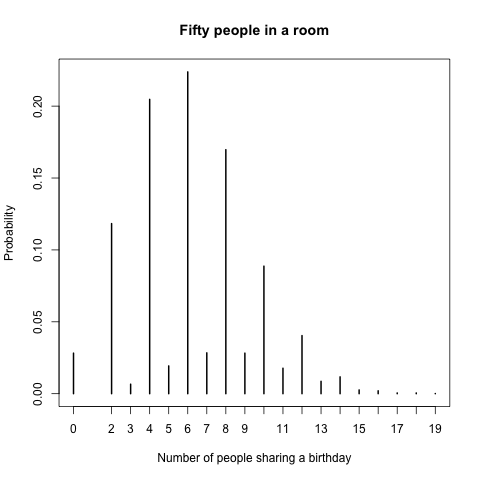
#+end_solution

#+begin_question
Example 5.8.

You toss a coin 100 times. After each toss, either there have been more heads, more tails, or the same number of heads and tails.
Let $X$ be the number of times in the 100 tosses that there were more heads than tails.
Estimate the pmf of $X$.
#+end_question

#+begin_solution
+ 通过 =coin_flips <- sample(c("H", "T"), 100, replace = TRUE)= 生成 100 次投币的结果。
+ 假设 =coin_flips= 是 =H H T T T T H H H T ...= 。
+ 那么 =coin_flips == "H"= 返回 =T T F F F F T T T F...= 。
+ =cumsum(coin_flips == "H")= 返回 =T= 的 *累计* 的次数，在这个例子中是 =1 2 2 2 2 2 3 4 5 5 ...= 。比如，为什么第 5 个分量是 2 ？这是因为投完 5 次币后，只有 2 次是正面朝上。
+ 类似地 =cumsum(coin_flips == "T")= 返回 =T= 出现的 *累计* 次数。显然 =cumsum(coin_flips == "H") + =cumsum(coin_flips == "T")== 一定是等于 =1 2 3 4 5 6 7 8 9 10 ...= 。
+  =cumsum(coin_flips == "H") > cumsum(coin_flips == "T")= 表示有多少次投币后，正面朝上的累计次数大于反面朝上的累计次数。

#+begin_src R :results output graphics file :file ./images/R_Speegle_Clair_2021_Example_5_8_More_heads_than_tails.png
  X <- replicate(100000,{
    coin_flips <- sample(c("H", "T"), 100, replace = TRUE)
    num_heads <- cumsum(coin_flips == "H")
    num_tails <- cumsum(coin_flips == "T")
    sum(num_heads > num_tails)
  })
  pmf <- proportions(table(X))
  plot(pmf, ylab = "Probability", xlab = "More heads than tails")
#+end_src

#+RESULTS[f4302cd2667b17a165fb8aaf8d612ab49cb0e446]:
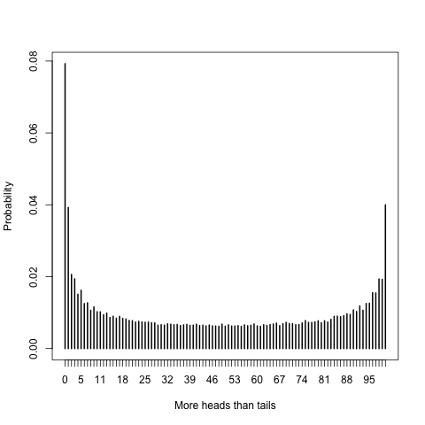

从图中可以看到，在各种情况中，概率最大的是「正面朝上的累计次数一直没有追上方面朝上的累计次数」。
这个结论真是难以想象！
#+end_solution

#+begin_question
Example 5.9.

Suppose you have a bag full of marbles; 50 are red and 50 are blue.
You are standing on a number line, and you draw a marble out of the bag.
If you get red, you go left one unit.
If you get blue, you go right one unit.
This is called a random walk.
You draw marbles up to 100 times, each time moving left or right one unit.
Let X be the number of marbles drawn from the bag until you return to 0 for the first time.
The rv X is called the first return time since it is the number of steps it takes to return to your starting position.

Estimate the pmf of X.
#+end_question

#+begin_solution
假设在数轴上进行 random walk。
开始的位置是 0 ，一共会走 100 步，每一步是随机地向左或向右跨一个单位长度，但要求有 50 步是向右跨，50 步向左跨。
那么最后一定是回到初始的位置 0。
设 X 是第一次回到初始位置时，所走过的步数。
显然，X 的可能取值是 2 到 100 之间的偶数。
我们的目标是模拟 X 的概率分布。 

+ 首先要随机生成一个由 50 个 1 和 50 个 -1 组成的向量。
  其中 1 表示向右走，-1 表示向左走。
  =rep(c(1,-1), times 100)= 生成向量 =1 -1 1 -1 1 -1 ...= 。
  然后随机打乱这些 $\pm 1$ 的次序： =movements <- sample(rep(c(1,-1), times = 100), 100, replace = FALSE)= 。
+ =cumsum(movements)= 计算每走完一步后，所到达的位置。
+ =which(cumsum(movements) == 0)= 返回有哪几次是回到初始位置 0 。
  

#+begin_src R :results output graphics file :file ./images/R_Speegle_Clair_2021_Example_5_9_Random_Walk.png
  X <- replicate(100000, {
    movements <- sample(rep(c(1,-1), times = 100), 100, replace = FALSE)
    min(which(cumsum(movements) == 0))
  })
  pmf <- proportions(table(X))
  plot(pmf,
       main = "First return time for a 100 step random walk",
       xlab = "Steps to return",
       ylab = "Probability"
  )
#+end_src

#+RESULTS[a251e85e17660187b7cb6d5c2c9170c5e356ceeb]:
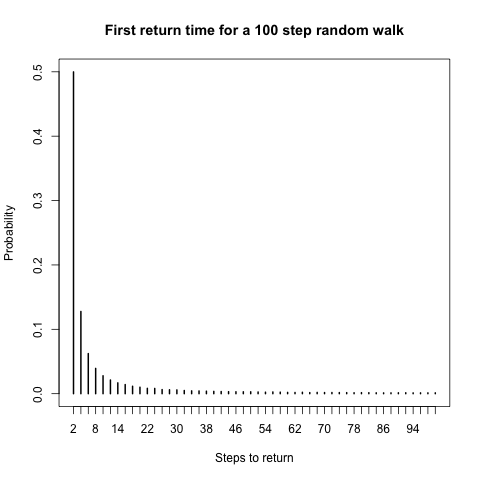

#+end_solution

** Estimating continuous distributions

和之前一样，向量 X 表示随机变量在各次随机试验中的取值。
当随机变量是连续型时，它几乎不会两次两次取到相同的值，所以 X 的分量一般来说是各不相同。
于是使用命令 =table(X)= 不再合适。。

我们可以将 X 的范围划分成若干段，并统计模拟中每个段内出现的数值个数。
这些计数可以通过在范围的每个段上方绘制一条垂直线来可视化，垂直线的高度对应于该段内出现的数值个数或比例。
由此得到的图表称为直方图（ /histogram/ ），可以使用 R 命令 =hist(X)= 轻松生成。
在 =hist= 中可以设置 =probability = TRUE= 来调整 y 轴上的刻度，使得直方图中每个矩形的面积就是随机变量落在矩形底边所给出的区间内的概率。

另外 =density(X)=  生成 X 的概率密度函数 ( /probability density function/ ,  /pdf/ )。
密度估计的高度是样本中所有数据点到各点距离的加权和。
靠近数据点较多的点具有较高的密度估计值，而远离数据点较多的点具有较低的密度估计值。
该图形会生成一条平滑曲线，其高度近似于随机变量的概率密度函数。

#+begin_question
Example 5.10.

Estimate the pdf of 2Z when Z is a standard normal random variable.
#+end_question

#+begin_solution
#+begin_src R :results output graphics file :file ./images/R_Speegle_Clair_2021_Example_5_10_twoNormal_hist.png
  Z <- rnorm(10000)
  twoZ <- 2*Z
  hist(twoZ,
       probability = TRUE,
       main = "Histogram of 2Z",
       xlab = "2Z")
#+end_src

#+RESULTS[c97ac8dd3cb57d460e911b2097b7618248d5b4ec]:
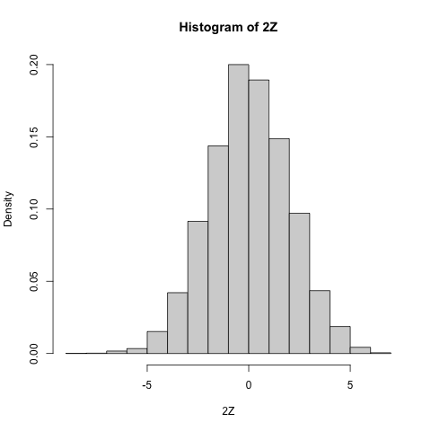

回忆 =dnorm(x, 0, 2)= 表示 Norm(0, 2) 的 pdf 。
通过 =curve= 可以画出函数的图形。

#+begin_src R :results output graphics file :file ./images/R_Speegle_Clair_2021_Example_5_10_twoNormal_hist_pdf.png
  Z <- rnorm(10000)
  twoZ <- 2*Z
  hist(twoZ,
       probability = TRUE,
       main = "Histogram of 2Z",
       xlab = "2Z")
  curve(dnorm(x, 0, 2), add = TRUE, col = "red")
#+end_src

#+RESULTS[70eb9168c53b2b7e2594fec789ed631702192671]:
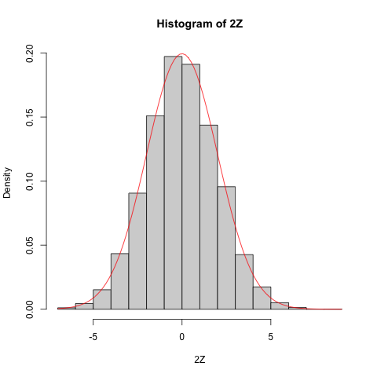

#+begin_src R :results output graphics file :file ./images/R_Speegle_Clair_2021_Example_5_10_twoNormal_pdf.png
  Z <- rnorm(10000)
  twoZ <- 2*Z
  plot(density(twoZ),
       main = "Density of 2Z",
       xlab = "2Z")
#+end_src

#+RESULTS[a220fc0b7901bd384a2a44f373e14d0edf91145b]:
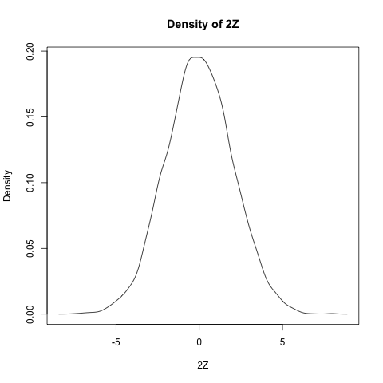

#+begin_src R :results output graphics file :file ./images/R_Speegle_Clair_2021_Example_5_10_twoNormal_pdf_2.png
  Z <- rnorm(10000)
  twoZ <- 2*Z
  plot(density(twoZ),
       main = "Density of 2Z and Norm(0, 2)",
       xlab = "2Z")
  curve(dnorm(x, 0, 2), add = TRUE, col = "red")
#+end_src

#+RESULTS[887cc91c4bf421341a47d451ddf573ee4d5bf61c]:
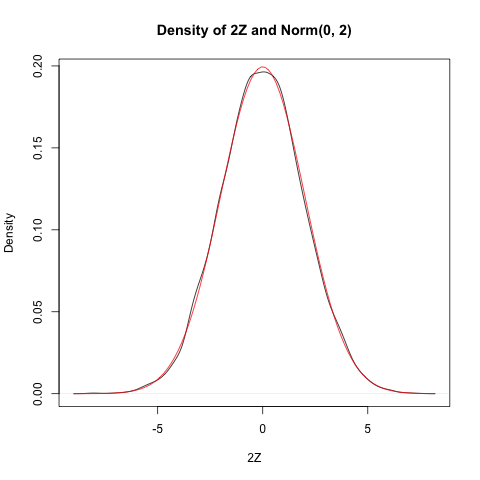

#+end_solution

#+begin_question
Example 5.14.

Estimate the pdf of $Z_{1} + Z_{2}$ where $Z_{1}$ and $Z_{2}$ are independent standard normal random variables.
#+end_question

#+begin_solution
由正态分布的可加性，$Z_{1} + Z_{2}$ 服从 Norm(0, 2) 。
我们将数值模拟和理论做比较。

#+begin_src R :results output graphics file :file ./images/R_Speegle_Clair_2021_Example_5_14_sum_two_normal.png
  Z1 <- rnorm(100000)
  Z2 <- rnorm(100000)
  plot(density(Z1 + Z2),
       main = "Sum of two standard normal rvs",
       xlab = expression(Z[1] + Z[2]))
  curve(dnorm(x, 0, sqrt(2)), add = TRUE, col = "red")
#+end_src

#+RESULTS[10f4f8355c3dd65bf276e7b4464c6bcfc8a898b9]:
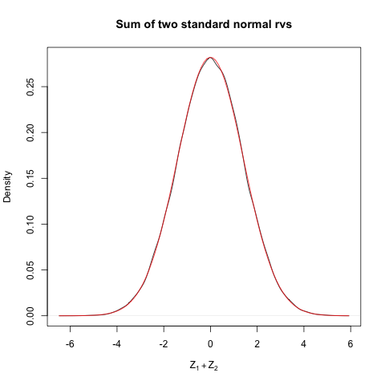

#+end_solution

#+begin_question
Example 5.18.

Let $X_{1}$, . . . , $X_{30}$ be independent Poisson random variables with rate 2.
From our knowledge of the Poisson distribution, each $X_{i}$ has mean $\mu = 2$ and standard deviation $\sigma = \sqrt{2}$.
Assuming n = 30 is a large enough sample size, the Central Limit Theorem says that
$$
Z = \frac{\bar{X} - 2}{\sqrt{2} /\sqrt{30}}
$$
will be approximately normal with mean 0 and standard deviation 1.
Let us check this with a simulation.
#+end_question

#+begin_solution
#+begin_src R :results output graphics file :file ./images/R_Speegle_Clair_2021_Example_5_18_sum_Poisson.png
  Z <- replicate(10000, {
    Xbar <- mean(rpois(30, 2))
    (Xbar - 2) / (sqrt(2) / sqrt(30))
  })
  plot(density(Z),
       main = "Standardized sum of 30 Poisson rvs",
       xlab = "Z")
  curve(dnorm(x), add = TRUE, col = "red")
#+end_src

#+RESULTS[748a2dba8a93cca51092c92cff09a905c43d017f]:
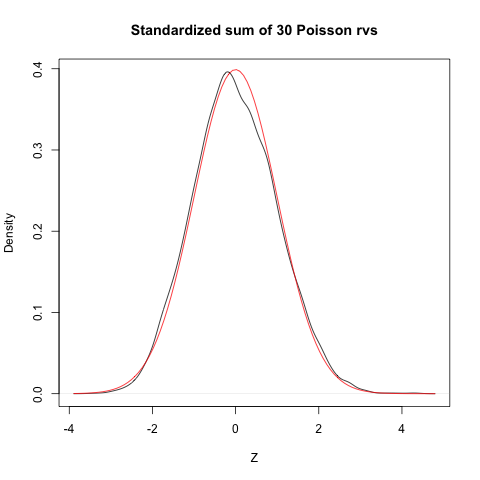

#+end_solution

** Exercises

#+begin_question
Exercise 5.1.

Let Z be a standard normal random variable. Estimate via simulation $P(Z^2 < 2)$.
#+end_question

#+begin_solution
#+begin_src R
  Z <- rnorm(100000, 0, 1)
  mean(Z^2 < 1)
#+end_src

#+RESULTS[eaf9d1b68c76fb75445a861171e8994fca7cac76]:
: [1] 0.68184

实际上 $Z^{2}$ 服从自由度为 1 的卡方分布，所以这个概率是
#+begin_src R
  pchisq(1, 1)
#+end_src

#+RESULTS[f8ab5c0277a869d6257017d6c7841ec29c78ba5d]:
: [1] 0.6826895

看见模拟的结果已经非常接近。
#+end_solution

#+begin_question
Exercise 5.2.

Let X and Y be independent exponential random variables with rate 3. Let Z = max(X, Y ) be the maximum of X and Y .

+ Estimate via simulation P(Z < 1/2).
+ Estimate the mean and standard deviation of Z.
#+end_question

#+begin_solution
#+begin_src R
  X <- rexp(100000, 3)
  Y <- rexp(100000, 3)
  Z <- pmax(X, Y)
  mean(Z < 1/2)
  mean(Z)
  sd(Z)
#+end_src

#+RESULTS[5c50b0e3d25db6f28ad50fcb94032bd4f6372478]:
: [1] 0.60354
: [1] 0.4996395
: [1] 0.3701348
#+end_solution

#+begin_question
Exercise 5.3.

Five coins are tossed and the number of heads X is counted.
Estimate via simulation the pmf of X.
#+end_question

#+begin_solution
#+begin_src R
  num_heads <- replicate(100000, {
    toss_coin <- sample(c("H", "T"), 5, replace = TRUE)
    sum(toss_coin == "H")
  })
  proportions(table(num_heads))
#+end_src

#+RESULTS[a0b395c60796b2d6b94226aa8486ba4cd88d1823]:
: num_heads
:       0       1       2       3       4       5 
: 0.03112 0.15999 0.31362 0.31005 0.15451 0.03071 
#+end_solution

#+begin_question
Exercise 5.4.

Three dice are tossed and their sum X is observed.
Use simulation to estimate and plot the pmf of X.
#+end_question

#+begin_solution
#+begin_src R
  sum_dice <- replicate(100000, {
    sum(sample(1:6, 3, replace = TRUE))
  })
  proportions(table(sum_dice))
#+end_src

#+RESULTS[515428a8c6f6dabcff4cc1e8fa3313170ff8c025]:
: sum_dice
:       3       4       5       6       7       8       9      10      11      12 
: 0.00432 0.01372 0.02681 0.04700 0.06923 0.09749 0.11585 0.12617 0.12556 0.11650 
:      13      14      15      16      17      18 
: 0.09525 0.06947 0.04591 0.02803 0.01390 0.00479 
#+end_solution

#+begin_question
Exercise 5.6.

Five six-sided dice are tossed and their product is observed.
Use the estimated pmf to find the most likely outcome.
(The R function =prod= computes the product of a vector.)
#+end_question

#+begin_solution
#+begin_src R
  pro_dice <- replicate(100000, {
    prod(sample(1:6, 5, replace = TRUE))
  })
  X <- proportions(table(pro_dice))
  which(X == max(X))
 max(X)
#+end_src

#+RESULTS[a6981b6fb322ba09d92cfe2e1ade54ea347a3470]:
: 360 
:  58 
: [1] 0.03901

模拟结果说明，乘积为 360 和 58 的概率最大，约为 4% 。
#+end_solution

#+begin_question
Exercise 5.7.

Fifty people put their names in a hat.
They then all randomly choose one name from the hat.
Let X be the number of people who get their own name.
Estimate and plot the pmf of X.
#+end_question

#+begin_solution
#+begin_src R
  orginal_order = c(1:50)
  X <- replicate(100000, {
    random_order <- sample(orginal_order, 50)
    sum(orginal_order == random_order)
  })
  pmf <- proportions(table(X))
  pmf
  png("./images/R_Speegle_Clair_2021_Exercise_5_7.png")
  plot(pmf,
       xlab = "选对名字的人数",
       ylab = "概率")
  dev.off()
#+end_src

#+RESULTS[23ae344140f4b87b3343c24aab7b61ab6a27e0c8]:
: X
:       0       1       2       3       4       5       6       7       8 
: 0.36814 0.36923 0.18391 0.05923 0.01597 0.00295 0.00052 0.00003 0.00002 
: null device 
:           1 

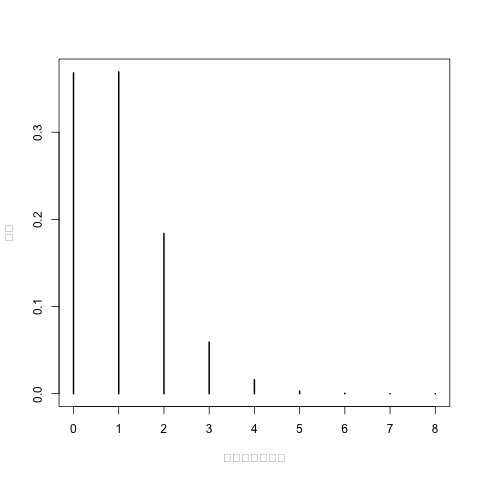

从模拟结果看，拿对名字的人数大概率是 0 或 1。
#+end_solution

#+begin_question
Exercise 5.11.

Simulate creating independent uniform random numbers in [0,1] and summing them until your cumulative sum is larger than 1.
Let N be the random variable which is how many numbers you needed to sample.
For example, if your numbers were 0.35, 0.58, 0.22 you would have N = 3 since the sum exceeds 1 after the third number.
What is the expected value of N?
#+end_question

#+begin_solution
#+begin_src R
  N <- replicate(1000000, {
    X <- runif(100, 0, 1)
    which.max(cumsum(X) > 1)
  })
  mean(N)
  pmf <- proportions(table(N))
  pmf
  png("./images/R_Speegle_Clair_2021_Exercise_5_11.png")
  plot(pmf,
       xlab = "N",
      ylab = "概率")
  dev.off()
#+end_src

#+RESULTS[45d9ec00565d308d320e6edb66375995c2999239]:
: [1] 2.718171
: N
:        2        3        4        5        6        7        8        9 
: 0.500199 0.332851 0.125486 0.033098 0.006986 0.001184 0.000183 0.000012 
:       10 
: 0.000001 
: null device 
:           1 

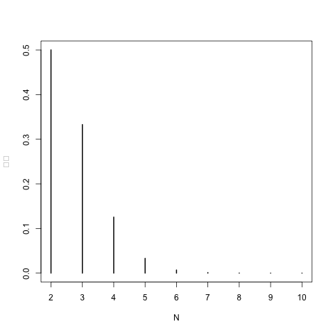

从模拟结果看，N 的平均值为 2.7，有大约 50% 的概率是 N = 2。
#+end_solution

#+begin_question
Exercise 5.13.

Suppose there are two candidates in an election.
Candidate A receives 52 votes and Candidate B receives 48 votes.
You count the votes one at a time, keeping a running tally of who is ahead.
At each point, either A is ahead, B is ahead, or they are tied.
Let X be the number of times that Candidate B is ahead in the 100 tallies.

+ Estimate the pmf of X and plot it.
+ Estimate P(X > 50).
#+end_question

#+begin_solution
+ 通过 =votes <- c(rep(1, 52), rep(-1, 48))= 生成一个 100 维的向量，包含 52 个 1 和 48 个 -1 。
  其中 1 表示投票给 A，-1 表示投票给 B。
+ =sample(votes, 100)= 模拟 100 个人依次投票，第 i 个分量为 1 则表示第 i 人投给 A，为 -1 则表示投给 B。
+ =cumsum(sample(votes, 100))= 统计每个人投票后，A 的票数减去 B 的票数。
  如果第 i 个分量大于（小于、等于） 0，则表示第 i 人投票后，A 领先（落后、持平）于 B。

#+begin_src R
  votes <- c(rep(1, 52), rep(-1, 48))
  X <- replicate(100000, {
    sum(cumsum(sample(votes, 100)) < 0)
  })
  pmf <- proportions(table(X))
  mean(X)
  mean(X > 50)
  pmf
  png("./images/R_Speegle_Clair_2021_Exercise_5_13.png")
  plot(pmf,
       xlab = "B 领先的次数",
       ylab = "概率")
  dev.off()
#+end_src

#+RESULTS[486d3a03014d51b1d8cef7e2bf2c2fcf9feaa267]:
#+begin_example
[1] 27.00166
[1] 0.19872
X
      0       1       2       3       4       5       6       7       8       9 
0.09306 0.05449 0.03111 0.02938 0.02432 0.02427 0.01984 0.02021 0.01904 0.01881 
     10      11      12      13      14      15      16      17      18      19 
0.01693 0.01763 0.01543 0.01619 0.01547 0.01513 0.01450 0.01397 0.01356 0.01360 
     20      21      22      23      24      25      26      27      28      29 
0.01300 0.01287 0.01219 0.01228 0.01247 0.01265 0.01226 0.01105 0.01079 0.01154 
     30      31      32      33      34      35      36      37      38      39 
0.01072 0.01032 0.01038 0.00996 0.00978 0.00986 0.00973 0.01001 0.00921 0.00896 
     40      41      42      43      44      45      46      47      48      49 
0.00931 0.00907 0.00899 0.00928 0.00796 0.00863 0.00852 0.00852 0.00778 0.00811 
     50      51      52      53      54      55      56      57      58      59 
0.00814 0.00815 0.00782 0.00745 0.00698 0.00717 0.00742 0.00706 0.00618 0.00633 
     60      61      62      63      64      65      66      67      68      69 
0.00637 0.00658 0.00624 0.00635 0.00610 0.00574 0.00561 0.00567 0.00532 0.00499 
     70      71      72      73      74      75      76      77      78      79 
0.00518 0.00512 0.00476 0.00469 0.00468 0.00441 0.00426 0.00430 0.00363 0.00366 
     80      81      82      83      84      85      86      87      88      89 
0.00324 0.00339 0.00295 0.00303 0.00250 0.00238 0.00200 0.00275 0.00176 0.00182 
     90      91      92      93      94      95 
0.00112 0.00114 0.00083 0.00067 0.00044 0.00048 
null device 
          1 
#+end_example

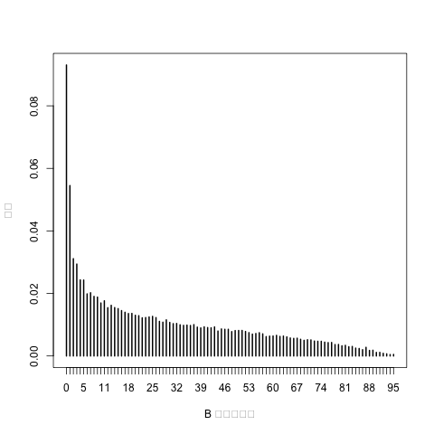

从模拟结果看，B 平均领先的次数为 27。
B 领先次数大于 50 的概率约为 19.8% 。
#+end_solution

#+begin_question
Exercise 5.15.

Let X and Y be independent uniform random variables on the interval [0, 1].
Let Z be the maximum of X and Y .

a. Plot the pdf of Z.

b. From your answer to (a), decide whether P(0 ≤ Z ≤ 1/3) or P(1/3 ≤ Z ≤ 2/3) is larger.
#+end_question

#+begin_solution
#+begin_src R
  num <- 100000
  Z <- runif(num, 0, 1) + runif(num, 0, 1)
  png("./images/R_Speegle_Clair_2021_Exercise_5_15.png")
  plot(density(Z),
       main = "Sum of two uniform rvs",
       xlab = "Z = X + Y",
       ylab = "概率")
  dev.off()
  mean(Z <= 1/3)
  mean(1/3 <= Z  & Z <= 2/3)
#+end_src

#+RESULTS[7eea3d77af0e4f0742ddfd4ca63594e6b15f896d]:
: null device 
:           1 
: [1] 0.05575
: [1] 0.16582

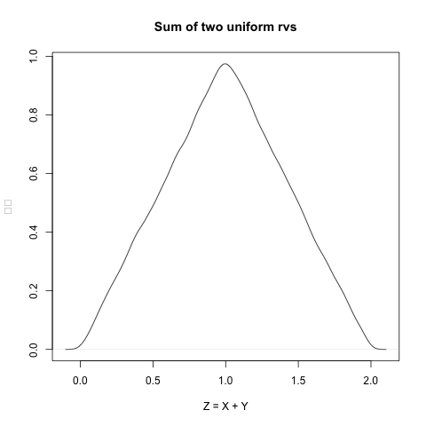
#+end_solution

#+begin_question
Exercise 5.20.

The minimum of two independent exponential rvs with mean 2 is an exponential rv.
Use simulation to determine what the rate is.
#+end_question

#+begin_solution
#+begin_src R
  num <- 1000000
  Z <- pmin(rexp(num, 2), rexp(num, 2))
  rate_Z <- 1/mean(Z)
  rate_Z
  png("./images/R_Speegle_Clair_2021_Exercise_5_20.png")
  plot(density(Z),
       xlab = "Z = X + Y",
       ylab = "概率")
  curve(dexp(x, rate_Z), add = TRUE, col = "red")
#+end_src

#+RESULTS[bee014d4723ce7996a3734c66cacbb110858a7f7]:
: [1] 4.002268

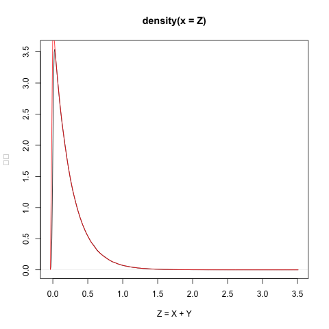

从模拟看，两条曲线非常接近，这说明 Z 服从参数为 =4= 的指数分布。
#+end_solution

#+begin_question
Exercise 5.22.

Richard Feynman said, “I couldn’t claim that I was smarter than sixty-five other guys–but the average of sixty-five other guys, certainly!”
Assume that “intelligence” is normally distributed with mean 0 and standard deviation 1 and that the 65 people Feynman is referring to are drawn at random.

a. Estimate via simulation the pdf of the maximum intelligence from among 65 people.

b. Estimate via simulation the pdf of the mean intelligence of 65 people.

c. (Open-ended) About how many standard deviations above the mean in intelligence did Feynman think he was?
#+end_question

#+begin_solution
没有求解原问题，而且模拟 65 人最高的「智商」的平均值。
然后求标准正态分布下，大于该平均值的概率。
从模拟来看，这个概率约为 1% 。

#+begin_src R
  max_65 <- replicate(100000, {
    max(rnorm(65, 0, 1))
  })
  X <- mean(max_65)
  pnorm(X, 0, 1, lower.tail = FALSE)
#+end_src

#+RESULTS[5298ee633852c5227dab405cdd1145a054084712]:
: [1] 0.009369262
#+end_solution

* Data Manipulation

#+begin_question
Exercise 6.1.
The built-in data set iris is a data frame containing measurements of the sepals and petals of 150 iris flowers.
Convert this data to a tibble with new variables =Sepal.Area= and =Petal.Area= which are the product of the corresponding length and width measurements.
#+end_question

#+begin_solution
=mutate()= : Create new variables by computation.

#+begin_src R :session *R*
  as_tibble(iris)
  iris_tibble <- as_tibble(iris) %>%
    mutate(Sepal.Area = Sepal.Length * Sepal.Width, Petal.Area = Petal.Length * Petal.Width)
  iris_tibble
#+end_src

#+RESULTS[3baff8b4a9c33034bf8d80d47bf52eb801b09948]:
#+begin_example
# A tibble: 150 × 5
   Sepal.Length Sepal.Width Petal.Length Petal.Width Species
          <dbl>       <dbl>        <dbl>       <dbl> <fct>  
 1          5.1         3.5          1.4         0.2 setosa 
 2          4.9         3            1.4         0.2 setosa 
 3          4.7         3.2          1.3         0.2 setosa 
 4          4.6         3.1          1.5         0.2 setosa 
 5          5           3.6          1.4         0.2 setosa 
 6          5.4         3.9          1.7         0.4 setosa 
 7          4.6         3.4          1.4         0.3 setosa 
 8          5           3.4          1.5         0.2 setosa 
 9          4.4         2.9          1.4         0.2 setosa 
10          4.9         3.1          1.5         0.1 setosa 
# ℹ 140 more rows
# ℹ Use `print(n = ...)` to see more rows
# A tibble: 150 × 7
   Sepal.Length Sepal.Width Petal.Length Petal.Width Species Sepal.Area
          <dbl>       <dbl>        <dbl>       <dbl> <fct>        <dbl>
 1          5.1         3.5          1.4         0.2 setosa        17.8
 2          4.9         3            1.4         0.2 setosa        14.7
 3          4.7         3.2          1.3         0.2 setosa        15.0
 4          4.6         3.1          1.5         0.2 setosa        14.3
 5          5           3.6          1.4         0.2 setosa        18  
 6          5.4         3.9          1.7         0.4 setosa        21.1
 7          4.6         3.4          1.4         0.3 setosa        15.6
 8          5           3.4          1.5         0.2 setosa        17  
 9          4.4         2.9          1.4         0.2 setosa        12.8
10          4.9         3.1          1.5         0.1 setosa        15.2
# ℹ 140 more rows
# ℹ 1 more variable: Petal.Area <dbl>
# ℹ Use `print(n = ...)` to see more rows
#+end_example
#+end_solution

